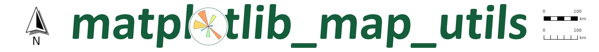
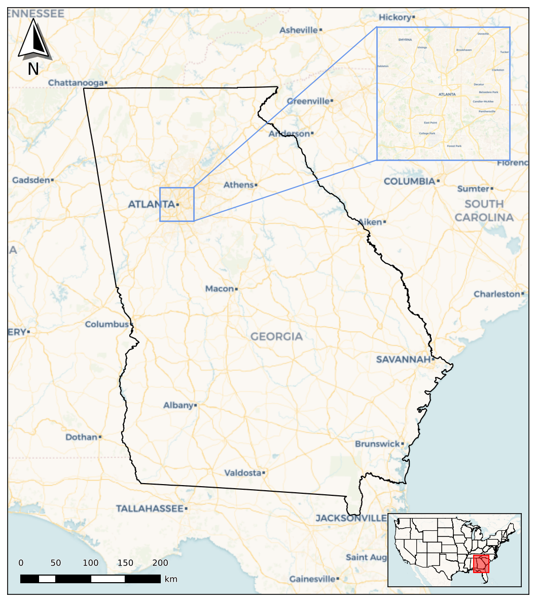
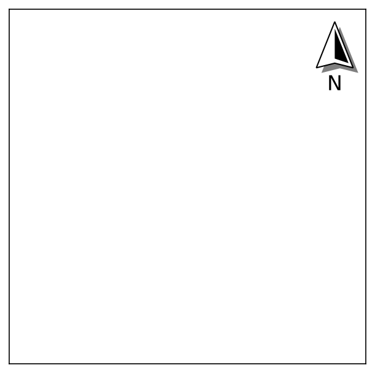
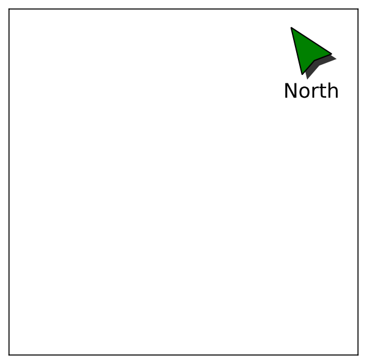
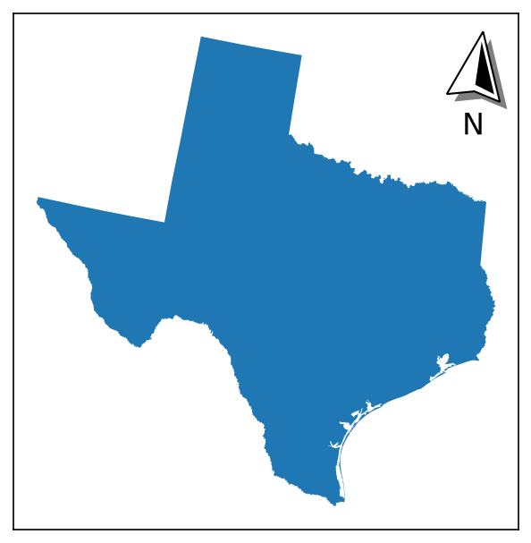
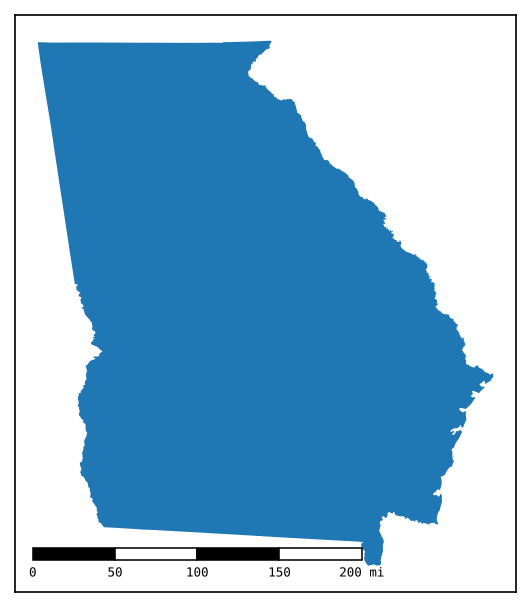
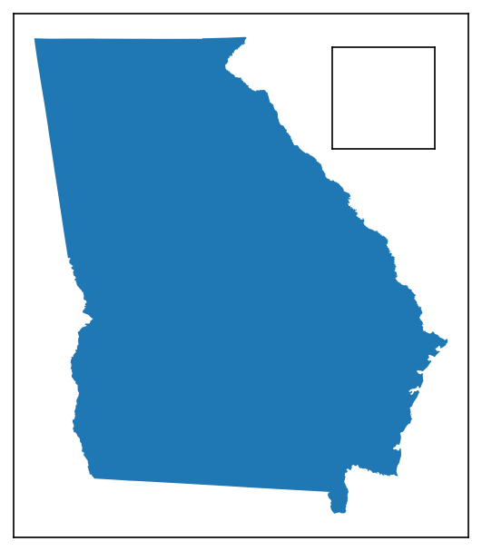
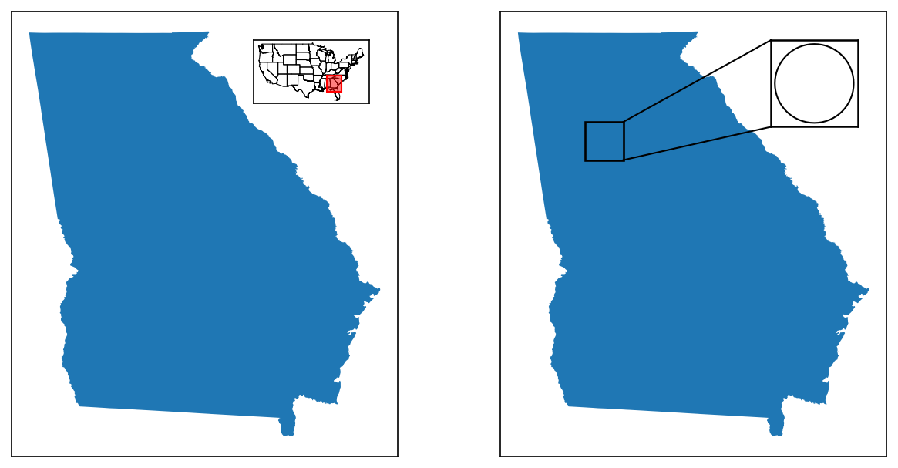

 
---

**Documentation:** See `docs` folder

**Source Code:** [Available on GitHub](https://github.com/moss-xyz/matplotlib-map-utils)

**Feedback:** I welcome any and all feedback! See the *Development Notes* below for more details.

---

### 👋 Introduction

`matplotlib_map_utils` is intended to be a package that provides various functions and objects that assist with the the creation of maps using [`matplotlib`](https://matplotlib.org/stable/).

As of `v3.x` (the current version), this includes three-ish elements: 

* `north_arrow.py`, for adding a north arrow to a given plot. 

* `scale_bar.py`, for adding a scale bar to a given plot. 

* `inset_map.py`, for adding inset maps and detail/extent indicators to a given plot. 

The three elements listed above are all intended to be high-resolution, easily modifiable, and context-aware, relative to your specific plot.

This package also contains a single utility object:

* `usa.py`, which contains a class that helps filter for states and territories within the USA based on given characteristics.

Together, these allow for the easy creation of a map such as the following:



---

### 💾 Installation

This package is available on PyPi, and can be installed like so:

```bash
pip install matplotlib-map-utils
```

The requirements for this package are:

* `python >= 3.10` (due to the use of the pipe operator to concatenate dictionaries and types)

* `matplotlib >= 3.9` (might work with lower versions but not guaranteed)

* `cartopy >= 0.23` (due to earlier bug with calling `copy()` on `CRS` objects)

---

### 📦 Package Structure

<details>
<summary><i>The package is arrayed in the following way:</i></summary>

```bash
package_name/
├── __init__.py
│
├── core/
│   ├── __init__.py
│   ├── inset_map.py
│   ├── north_arrow.py
│   ├── scale_bar.py
├── validation/
│   ├── __init__.py
│   ├── functions.py
│   └── inset_map.py
│   ├── north_arrow.py
│   └── scale_bar.py
├── defaults/
│   ├── __init__.py
│   ├── north_arrow.py
│   └── scale_bar.py
│   └── inset_map.py
├── utils/
│   ├── __init__.py
│   ├── usa.py
│   └── usa.json
```

Where:

* `core` contains the main functions and classes for each object

* `validation` contains type hints for each variable and functions to validate inputs

* `defaults` contains default settings for each object at different paper sizes

* `utils` contains utility functions and objects

</details>

---

### 🧭 North Arrow

<details>
<summary><i>Expand instructions</i></summary>

#### Quick Start

Importing the North Arrow functions and classes can be done like so:

```py
from matplotlib_map_utils.core.north_arrow import NorthArrow, north_arrow
from matplotlib_map_utils.core import NorthArrow, north_arrow # also valid
from matplotlib_map_utils import NorthArrow, north_arrow # also valid
```

The quickest way to add a single north arrow to a single plot is to use the `north_arrow` function:

```python
# Setting up a plot
fig, ax = matplotlib.pyplot.subplots(1,1, figsize=(5,5), dpi=150)
# Adding a north arrow to the upper-right corner of the axis, without any rotation (see Rotation under Formatting Components for details)
north_arrow.north_arrow(ax=ax, location="upper right", rotation={"degrees":0})
```

An object-oriented approach is also supported:

```python
# Setting up a plot
fig, ax = matplotlib.pyplot.subplots(1,1, figsize=(5,5), dpi=150)
# Creating a north arrow for the upper-right corner of the axis, without any rotation (see Rotation under Formatting Components for details)
na = north_arrow.NorthArrow(location="upper right", rotation={"degrees":0})
# Adding the artist to the plot
ax.add_artist(na)
```

Both of these will create an output like the following:



#### Customization

Both the object-oriented and functional approaches can be customized to allow for fine-grained control over formatting:

```python
north_arrow(
    ax,
    location = "upper right", # accepts a valid string from the list of locations
    scale = 0.5, # accepts a valid positive float or integer
    # each of the follow accepts arguments from a customized style dictionary
    base = {"facecolor":"green"},
    fancy = False,
    label = {"text":"North"},
    shadow = {"alpha":0.8},
    pack = {"sep":6},
    aob = {"pad":2},
    rotation = {"degrees": 35}
)
```

This will create an output like the following:



Refer to `docs\howto_north_arrow` for details on how to customize each facet of the north arrow. 

_Note: only add a north arrow **after** adding all of your geodata and changing your axis limits!_

#### Rotation

The north arrow object is also capable of pointing towards "true north", given a CRS and reference point:



Instructions for how to do so can be found in `docs\howto_north_arrow`.
</details>

---

### 📏 Scale Bar

<details>
<summary><i>Expand instructions</i></summary>

#### Quick Start

Importing the Scale Bar functions and classes can be done like so:

```py
from matplotlib_map_utils.core.scale_bar import ScaleBar, scale_bar
from matplotlib_map_utils.core import ScaleBar, scale_bar # also valid
from matplotlib_map_utils import ScaleBar, scale_bar # also valid
```

There are two available styles for the scale bars: `boxes` and `ticks`. The quickest way to add one to a single plot is to use the `scale_bar` function:

```python
# Setting up a plot
# NOTE: you MUST set the desired DPI here, when the subplots are created
# so that the scale_bar's DPI matches!
fig, ax = matplotlib.pyplot.subplots(1,1, figsize=(5,5), dpi=150)
# Adding a scale bar to the upper-right corner of the axis, in the same projection as whatever geodata you plotted
# Here, this scale bar will have the "boxes" style
scale_bar(ax=ax, location="upper right", style="boxes", bar={"projection":3857})
```

An object-oriented approach is also supported:

```python
# Setting up a plot
# NOTE: you MUST set the desired DPI here, when the subplots are created
# so that the scale_bar's DPI matches!
fig, ax = matplotlib.pyplot.subplots(1,1, figsize=(5,5), dpi=150)
# Adding a scale bar to the upper-right corner of the axis, in the same projection as whatever geodata you plotted
# Here, we change the boxes to "ticks"
sb = ScaleBar(location="upper right", style="ticks", bar={"projection":3857})
# Adding the artist to the plot
ax.add_artist(sb)
```

Both of these will create an output like the following (function is left, class is right):


#### Customization

Both the object-oriented and functional approaches can be customized to allow for fine-grained control over formatting:

```python
scale_bar(
    ax,
    location = "upper right", # accepts a valid string from the list of locations
    style = "boxes", # accepts a valid positive float or integer
    # each of the follow accepts arguments from a customized style dictionary
    bar = {"unit":"mi", "length":2}, # converting the units to miles, and changing the length of the bar (in inches)
    labels = {"style":"major", "loc":"below"}, # placing a label on each major division, and moving them below the bar
    units = {"loc":"text"}, # changing the location of the units text to the major division labels
    text = {"fontfamily":"monospace"}, # changing the font family of all the text to monospace
)
```

This will create an output like the following:



Refer to `docs\howto_scale_bar` for details on how to customize each facet of the scale bar.

_Note: only add a scale bar **after** adding all of your geodata and changing your axis limits!_

#### Specifying Length

There are three main ways of specifying the length of a scale bar:

- `length` is used to set the total length of the bar, either in _inches_ (for values >= 1) or as a _fraction of the axis_ (for values < 1).
  - The default value of the scale bar utilizes this method, with a `length` value of `0.25` (meaning 25% of the axis).
  - It will automatically orient itself against the horizontal or vertical axis when calculating its fraction, based on the value supplied for `rotation`.
  - Note that any values here will be rounded to a "nice" whole integer, so the length will *always be approximate*; ex., if two inches is 9,128 units, your scale bar will end up being 9,000 units, and therefore a little less than two inches.
  - Values `major_div` and `minor_div` are ignored, while a value for `max` will _override_ `length`.

- `max` is used to define the total length of the bar, _in the same units as your map_, as determined by the value of `projection` and `unit`.
  - Ex: If you are using a projection in feet, and give a `max` of `1000`, your scale bar will be representative of 1,000 feet.
  - Ex: If you are using a projection in feet, but provide a value of `meter` to `unit`, and give a `max` of `1000`, your scale bar will be representative of 1,000 meters.
  - Will _override_ any value provided for `length`, and give a warning that it is doing so!
  - Values can be optionally be provided for `major_div` and `minor_div`, to subdivide the bar into major or minor segments as you desire; if left blank, values for these will be calculated automatically (see `preferred_divs` in `validation/scale_bar.py` for the values used).

- `major_mult` can be used alongside `major_div` to _derive_ the total length: `major_mult` is the _length of a **single** major division_, in the _same units as your map_ (as determined by the value of `projection` and `unit`), which is then multiplied out by `major_div` to arrive at the desired length of the bar.
  - Ex: If you set `major_mult` to 1,000, and `major_div` to 3, your bar will be 3,000 units long, divided into three 1,000 segments.
  - This is the _only_ use case for `major_mult` - using it anywhere else will result in warnings and/or errors!
  - Specifying either `max` or `length` will override this method!
  - `minor_div` can still be _optionally_ provided.

All of the above cases expect a valid CRS to be supplied to the `projection` parameter, to correctly calculate the relative size of the bar with respect to the map's underlying units. However, three _additional_ values may be passed to `projection`, to override this behavior entirely:

- If `projection` is set to `px`, `pixel`, or `pixels`, then values for `max` and `major_mult` are interpreted as being in _pixels_ (so a `max` of 1,000 will result in a bar 1,000 pixels long)

- If `projection` is set to `pt`, `point`, or `points`, then values for `max` and `major_mult` are interpreted as being in _points_ (so a `max` of 1,000 will result in a bar 1,000 points long (a point is 1/72 of an inch))

- If `projection` is set to `dx`, `custom`, or `axis`, then values for `max` and `major_mult` are interpreted as being in _the units of the x or y axis_ (so a `max` of 1,000 will result in a bar equal to 1,000 units of the x-axis (if orientated horizontally))

The intent of these additional methods is to provide an alternative interface for defining the bar, in the case of non-standard projections, or for non-cartographic use cases (in particular, this is inspired by the `dx` implementation of `matplotlib-scalebar`). However, this puts the onus on the user to know how big their bar should be - you also cannot pass a value to `unit` to convert! Note you can provide custom label text to the bar via the `labels` and `units` arguments (ex. if you need to label "inches" or something).
</details>

---

### 🗺️ Inset Map

<details>
<summary><i>Expand instructions</i></summary>

#### Quick Start

Importing the Inset Map functions and classes can be done like so:

```py
from matplotlib_map_utils.core.inset_map import InsetMap, inset_map, ExtentIndicator, indicate_extent, DetailIndicator, indicate_detail
from matplotlib_map_utils.core import InsetMap, inset_map, ExtentIndicator, indicate_extent, DetailIndicator, indicate_detail # also valid
from matplotlib_map_utils import InsetMap, inset_map, ExtentIndicator, indicate_extent, DetailIndicator, indicate_detail # also valid
```

The quickest way to add a single inset map to an existing plot is the `inset_map` function:

```python
# Setting up a plot
fig, ax = matplotlib.pyplot.subplots(1,1, figsize=(5,5), dpi=150)
# Adding an inset map to the upper-right corner of the axis
iax = inset_map(ax=ax, location="upper right", size=0.75, pad=0, xticks=[], yticks=[])
# You can now plot additional data to iax as desired
```

An object-oriented approach is also supported:

```python
# Setting up a plot
fig, ax = matplotlib.pyplot.subplots(1,1, figsize=(5,5), dpi=150)
# Creating an object for the inset map
im = InsetMap(location="upper right", size=0.75, pad=0, xticks=[], yticks=[])
# Adding the inset map template to the plot
iax = im.create(ax=ax)
# You can now plot additional data to iax as desired
```

Both of these will create an output like the following:



#### Extent and Detail Indicators

Inset maps can be paired with either an extent or detail indicator, to provide additional geographic context to the inset map

```python
indicate_extent(inset_axis, parent_axis, inset_crs, parent_crs, ...)
indicate_detail(parent_axis, inset_axis, parent_crs, inset_crs, ...)
```

This will create an output like the following (extent indicator on the left, detail indicator on the right):



Refer to `docs\howto_inset_map` for details on how to customize the inset map and indicators to your liking.
</details>

---

### 🛠️ Utilities

<details>
<summary><i>Expand instructions</i></summary>

#### Quick Start

Importing the bundled utility functions and classes can be done like so:

```py
from matplotlib_map_utils.utils import USA
```

As of `v2.1.0`, there is only one utility class available: `USA`, an object to help quickly filter for subsets of US states and territories. This utility class is still in beta, and might change.

An example:

```python
# Loading the object
usa = USA()
# Getting a list FIPS codes for US States
usa.filter(states=True, to_return="fips")
# Getting a list of State Names for states in the South and Midwest regions
usa.filter(region=["South","Midwest"], to_return="name")
```

Refer to `docs\howto_utils` for details on how to use this class, including with `pandas.apply()`.
</details>

---

### 📝 Development Notes

#### Inspiration and Thanks

This project was heavily inspired by [`matplotlib-scalebar`](https://github.com/ppinard/matplotlib-scalebar/), and much of the code is either directly copied or a derivative of that project, since it uses the same "artist"-based approach.

Two more projects assisted with the creation of this script:

* [`EOmaps`](https://github.com/raphaelquast/EOmaps/discussions/231) provided code for calculating the rotation required to point to "true north" for an arbitrary point and CRS for the north arrow.

* [`Cartopy`](https://github.com/SciTools/cartopy/issues/2361) fixed an issue inherent to calling `.copy()` on `CRS` objects.

#### Releases

<details>
<summary><i>See prior release notes</i></summary>

- `v1.0.x`: Initial releases featuring the North Arrow element, along with some minor bug fixes.

- `v2.0.0`: Initial release of the Scale Bar element.

- `v2.0.1`: Fixed a bug in the `dual_bars()` function that prevented empty dictionaries to be passed. Also added a warning when auto-calculated bar widths appear to be exceeding the dimension of the axis (usually occurs when the axis is <2 kilometers or miles long, depending on the units selected).

- `v2.0.2`: Changed f-string formatting to alternate double and single quotes, so as to maintain compatibility with versions of Python before 3.12 (see [here](https://github.com/moss-xyz/matplotlib-map-utils/issues/3)). However, this did reveal that another aspect of the code, namely concatenating `type` in function arguments, requires 3.10, and so the minimum python version was incremented.

- `v2.1.0`: Added a utility class, `USA`, for filtering subsets of US states and territories based on FIPS code, name, abbreviation, region, division, and more. This is considered a beta release, and might be subject to change later on.
</details>

- `v3.0.0`: Release of inset map and extent and detail indicator classes and functions.

- `v3.0.1`: Fixed a bug that led to an incorrect Scale Bar being rendered when using the function method (`scale_bar()`) on a plot containing raster data (see [here](https://github.com/moss-xyz/matplotlib-map-utils/issues/10) for details).

- `v3.1.0`: Overhauled the functionality for specifying the the length of a scale bar, including support for custom units/projections (similar to `matplotlib-scalebar`'s `dx` argument) and to specify the length of a major division instead of the entire scale bar, as requested [here](https://github.com/moss-xyz/matplotlib-map-utils/issues/10). Added ability to set artist-level `zorder` variables for all elements, with both the function and class method approaches, as requested [here](https://github.com/moss-xyz/matplotlib-map-utils/issues/9) and [here](https://github.com/moss-xyz/matplotlib-map-utils/issues/10). Also fixed a bug related to custom division labels on the scale bar.

- `v3.1.1`: Fixed a bug that led to errors when creating a `scale_bar` at resolutions below 5km or 1 mile, due to a bug in the backend configuration functions (namely, `_config_bar_dim()`), which was fixed by correctly instantiating the necessary variable `ax_units` in other cases via an `else` statement (see [here](https://github.com/moss-xyz/matplotlib-map-utils/issues/14) for details).

#### Future Roadmap

With the release of `v3.x`, this project has achieved full coverage of the "main" map elements I think are necessary.

<details>
<summary><i>If I continue development of this project, I will be looking to add or fix the following features:</i></summary>

* For all: switch to a system based on Pydantic for easier type validation

* **North Arrow:** 

  * Copy the image-rendering functionality of the Scale Bar to allow for rotation of the entire object, label and arrow together
  
  * Create more styles for the arrow, potentially including a compass rose and a line-only arrow

* **Scale Bar:**

  * Allow for custom unit definitions (instead of just metres/feet/miles/kilometres/etc.), so that the scale bar can be used on arbitrary plots (such as inches/cm/mm, mathmatical plots, and the like)

  * Fix/improve the `dual_bars()` function, which currently doesn't work great with rotations

  * Clean up the variable naming scheme (consistency on `loc` vs `position`, `style` vs `type`, etc.)

  * Create more styles for the bar, potentially including dual boxes and a sawtooth bar

* **Inset Map:**

  * Clean up the way that connectors are drawn for detail indicators

  * New functionality for placing multiple inset maps at once (with context-aware positioning to prevent overlap with each other)

* **Utils:**

  * (USA): Stronger fuzzy search mechanics, so that it will accept flexible inputs for FIPS/abbr/name

  * (USA): More integrated class types to allow for a more fully-formed object model (USA being a `Country`, with subclasses related to `State` and `Territory` that have their own classes of attributes, etc.)

  * (USA): Stronger typing options, so you don't have to recall which `region` or `division` types are available, etc.

Future releases (if the project is continued) will probably focus on other functions that I have created myself that give more control in the formatting of maps. I am also open to ideas for other extensions to create!

</details>

#### Support and Contributions

If you notice something is not working as intended or if you'd like to add a feature yourself, I welcome PRs - just be sure to be descriptive as to what you are changing and why, including code examples!

If you are having issues using this script, feel free to leave a post explaining your issue, and I will try and assist, though I have no guaranteed SLAs as this is just a hobby project.

I am open to contributions, especially to help tackle the roadmap above!

---

### ⚖️ License

I know nothing about licensing, so I went with the GPL license. If that is incompatible with any of the dependencies, please let me know.