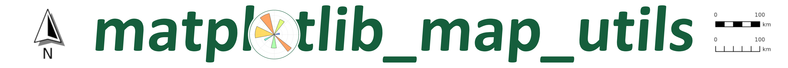
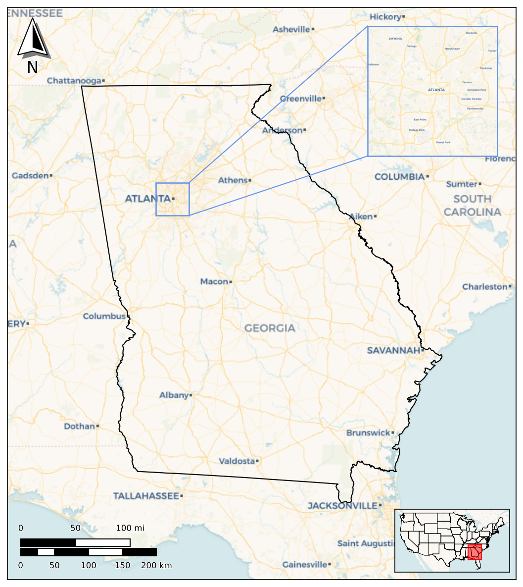

 
---

**Documentation:** See `docs` folder

**Source Code:** [Available on GitHub](https://github.com/moss-xyz/matplotlib-map-utils)

**Feedback:** I welcome any and all feedback! See the *Development Notes* below for more details.

**Current Version:** `v4.0.0`, featuring a brand-new documentation site!

---

### 👋 Introduction

`matplotlib_map_utils` is a package that that assists with the creation of maps using [`matplotlib`](https://matplotlib.org/stable/).

As of `v3.x` (the current version), this includes the ability to easily create three common map elements: 

* <span style="color: orange; font-weight: bold;">North arrows</span>, which automatically point to true north,

* <span style="color: orange; font-weight: bold;">Scale bars</span>, available in different styles and automatic unit conversion, and

* <span style="color: orange; font-weight: bold;">Inset maps</span>, including both detail and extent-style plots. 

The three elements listed above are all intended to be high-resolution, easily modifiable, and context-aware relative to your specific plot.

This package also contains a single utility object:

* <span style='color: orange; font-weight: bold; font-family: var(--md-code-font-family);'>USA</span>, a class that helps filter for states and territories within the USA based on given characteristics, used primarily for building queries based on FIPS codes or names.

Together, these allow for the (relatively) easy creation of a map such as the following:



---

### 💾 Installation

This package is available on PyPi, and can be installed like so:

```bash
pip install matplotlib-map-utils
# or
uv add matplotlib-map-utils
```

The requirements for this package are:

* `python >= 3.10` (due to the use of the pipe operator to concatenate dictionaries and types)

* `matplotlib >= 3.9` (might work with lower versions but not guaranteed)

* `cartopy >= 0.23` (due to earlier bug with calling `copy()` on `CRS` objects)

---

### Quick Start and Usage Guides

For a primer on how to import the package and use the primary functions and methods to create elements, see the [Quick Start guide](https://moss_xyz.github.io/matplotlib_map_utils/quick).

Each part of the package also has a dedicated page that lays out usage and customisation options in more detail:

- 🧭  [__North Arrows__](https://moss_xyz.github.io/matplotlib_map_utils/north_arrows)
- 📏  [__Scale Bars__](https://moss_xyz.github.io/matplotlib_map_utils/scale_bars)
- 🗺️  [__Inset Maps__](https://moss_xyz.github.io/matplotlib_map_utils/inset_maps)
- 🛠️  [__Utilities__](https://moss_xyz.github.io/matplotlib_map_utils/utilities)

Finally, the [Package Information page](https://moss_xyz.github.io/matplotlib_map_utils/package) provides additional context around the development of and overall structure of the package.

---

### Support and Contributions

If you notice something is not working as intended or if you'd like to add a feature yourself, I welcome PRs - just be sure to be descriptive as to what you are changing and why, including code examples!

If you are having issues using this script, feel free to leave a post explaining your issue, and I will try and assist, though I have no guaranteed SLAs as this is just a hobby project.

I am open to contributions, especially to help tackle the roadmap above!

---

### ⚖️ License

I know nothing about licensing, so I went with the GPL license. If that is incompatible with any of the dependencies, please let me know.