This guide is structured like a tutorial, in order to showcase the various options and methods available; if you would like to follow along, a few additional packages and set-up steps are required:

## Set-Up

```python
# Packages used by this tutorial
import geopandas # manipulating geographic data
import numpy # creating arrays
import pygris # easily acquiring shapefiles from the US Census
import matplotlib.pyplot # visualization

# Downloading the state-level dataset from pygris
states = pygris.states(cb=True, year=2022, cache=False).to_crs(3857)

# This is just a function to create a new, blank map with matplotlib, with our default settings
def new_map(rows=1, cols=1, figsize=(5,5), dpi=150, ticks=False):
	# Creating the plot(s)
	fig, ax = matplotlib.pyplot.subplots(rows,cols, figsize=figsize, dpi=dpi)
	# Turning off the x and y axis ticks
	if ticks==False:
		if rows > 1 or cols > 1:
			for a in ax.flatten():
				a.set_xticks([])
				a.set_yticks([])
		else:
			ax.set_xticks([])
			ax.set_yticks([])
	# Returning the fig and ax
	return fig, ax
```

The above is only necessary for this specific tutorial; below, we import the main elements related to north arrows:

```python
# Importing the main package
from matplotlib_map_utils import NorthArrow, north_arrow
```

## Creating a North Arrow

### Using the `north_arrow()` function
The quickest and easiest way to add a north arrow to a single plot is using the `north_arrow()` function. This will automatically create the artist _and_ apply it to the supplied axis.

```python
# Setting up a plot
fig, ax = new_map()

# Plotting a state (Georgia)
states.query("NAME=='Georgia'").plot(ax=ax)

# Adding a north arrow to the upper-right corner of the axis, without any rotation (see Rotation under Formatting Components for details)
north_arrow(ax=ax, location="upper right", rotation={"degrees":0})
```

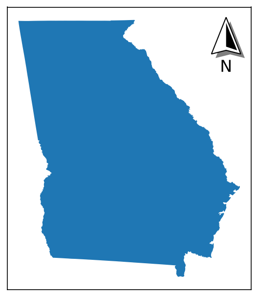
		
### Using the `NorthArrow` class
Alternatively, a `NorthArrow` class (based on `matplotlib.artist.Artist`) is also provided that allows the same arrow to be rendered like so:

```python
# Setting up a plot
fig, ax = new_map()

# Plotting a state (Georgia)
states.query("NAME=='Georgia'").plot(ax=ax)

# Creating a NorthArrow object that we want to place in the upper-right corner of the axis, 
# without any rotation (see Rotation under Formatting Components for details)
# Note that here, we do not specify the axis
na = NorthArrow(location="upper right", rotation={"degrees":0})

# The NorthArrow can then be added using add_artist(), which calls its built-in draw() function:
ax.add_artist(na)
```


#### Re-using Objects
The benefit of the NorthArrow object is that <span class="strong-fg">it can be re-used across multiple plots without copy-pasting the function call</span>. This is particularly beneficial for highly-customized arrows: you can simply set it up once, and then add it to each axis you want.

The caveat to this is that instead of using `ax.add_artist(NorthArrow)`, you have to use `ax.add_artist(NorthArrow.copy())`, as `matplotlib` does not let you add the same artist to multiple axes, so you have to add a *copy* of the artist.


=== "Invalid"
	Here, we try and re-use the `na` artist we created above, which has already been applied to the plot of Georgia
	```python
	# Setting up a plot
	fig, ax = new_map()
	
	# Plotting a new state (Texas)
	states.query("NAME=='Texas'").plot(ax=ax)
	
	# Trying to re-use the same artist - this will throw an error
	ax.add_artist(na)
	```

	Returns:
	```py
	ValueError Can not reset the Axes. You are probably trying to reuse an artist in more than one Axes which is not supported
	```

=== "Valid"
	Now, we're starting from scratch:
	```python
	# Setting up plots for both Georgia and Texas
	ga_fig, ga_ax = new_map()
	tx_fig, tx_ax = new_map()
	
	# Plotting each state
	states.query("NAME=='Georgia'").plot(ax=ga_ax)
	states.query("NAME=='Texas'").plot(ax=tx_ax)

	# Setting up the north arrow artist 
	na = NorthArrow(location="upper right", rotation={"degrees":0})

	# Applying the artist to each plot
	# Note we have to call .copy() EACH TIME
	ga_ax.add_artist(na.copy())
	tx_ax.add_artist(na.copy())
	```

	Returns:
	<div class="grid cards" markdown>
	
	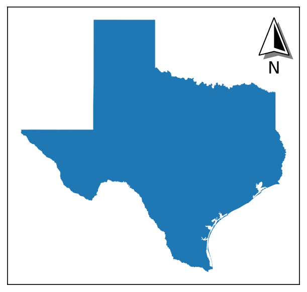
	</div>

#### Updating Objects
The customization options of the NorthArrow can be accessed using dot notation (like `na.base`, `na.label`, etc.). They can also be updated from this dot notation by passing a valid style dictionary (see next section for details).

=== "Accessing Values"
	```python
	# Showing the labels style options
	na.label
	```

	Returns:
	```py
	{'text': 'N',
	'position': 'bottom',
	'ha': 'center',
	'va': 'baseline',
	'fontsize': 16,
	'fontfamily': 'sans-serif',
	'fontstyle': 'normal',
	'color': 'black',
	'fontweight': 'regular',
	'stroke_width': 1,
	'stroke_color': 'white',
	'rotation': 0,
	'zorder': 99}
	```

=== "Updating Values"
	```python
	# Updating the label style option for "position"
	na.label = {"position":"top"}
	na.label
	```

	Returns:
	```py
	{'text': 'N',
	'position': 'top',
	'ha': 'center',
	'va': 'baseline',
	'fontsize': 16,
	'fontfamily': 'sans-serif',
	'fontstyle': 'normal',
	'color': 'black',
	'fontweight': 'regular',
	'stroke_width': 1,
	'stroke_color': 'white',
	'rotation': 0,
	'zorder': 99}
	```

This means you can update the properties of the created class while it is in use, in case you want small changes made in between iterations:

```python
shapes = ["Texas","Georgia","California","Louisiana"]
labels = ["First","Second","Third","Fourth"]

# Creating the initial arrow
na = NorthArrow(location="upper right", rotation={"degrees":0})

# Creating four subplots
fig, axs = new_map(1,4, figsize=(20,5))

for ax,s,l in zip(axs.flatten(), shapes, labels):
	states.query(f"NAME=='{s}'").plot(ax=ax)
	ax.set_aspect(1, adjustable="datalim")
	na.label = {"text":l}
	ax.add_artist(na.copy())
```


Though for this specific example, you could accomplish the same with the `north_arrow()` function just as (more?) easily

```python
shapes = ["Texas","Georgia","California","Louisiana"]
labels = ["First","Second","Third","Fourth"]

# Creating four subplots
fig, axs = new_map(1,4, figsize=(20,5))

for ax,s,l in zip(axs.flatten(), shapes, labels):
	states.query(f"NAME=='{s}'").plot(ax=ax)
	ax.set_aspect(1, adjustable="datalim")
	north_arrow(ax=ax, location="upper right", label={"text":l}, rotation={"degrees":0})
```
		
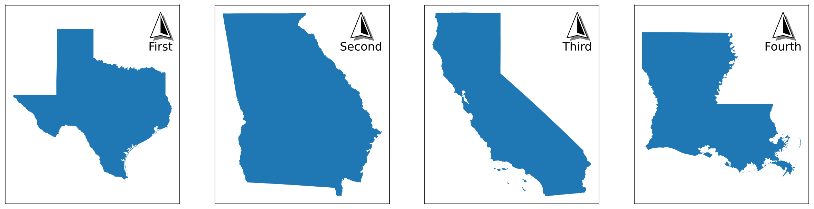

---

## Customizing the North Arrow

Both the functional and object-oriented approach use the same primitive style dictionaries, so you can treat the following information as valid for both.

### Primary Settings

There are three primary settings that must be supplied each time a north arrow is created:

| Attribute | Description | Accepts |
| :--- | :--- | :--- |
| `location` | Where the arrow will be placed relative to the plot. | Any options accepted by `matplotlib` for legend placement (`"upper right"`, `"center"`, `"lower left"`, etc., see *loc* in the [`matplotlib.pyplot.legend`](https://matplotlib.org/stable/api/_as_gen/matplotlib.pyplot.legend.html) documentation) |
| `scale` | The desired size of the north arrow's *height*, in inches; the default is whatever size is set by the `size` parameter (see *Tips and Tricks* section). | Any positive number |
| `zorder` | (new as of `v3.1.0`) The zorder of the final north arrow artist, which can be used to bring the artist forward / place it behind other axis artists. | Any number; default value is 99 |

=== "Locations"

	```python
	# Grid of location options
	locs = ["upper left", "upper center", "upper right", "center left", "center", "center right", "lower left", "lower center", "lower right"]
	
	fig, axs = new_map(3,3, figsize=(9,9))
	
	for ax,l in zip(axs.flatten(), locs):
		states.query(f"NAME=='Georgia'").plot(ax=ax)
		ax.set_aspect(1, adjustable="datalim")
		north_arrow(ax=ax, location=l, rotation={"degrees":0})
	```
		
	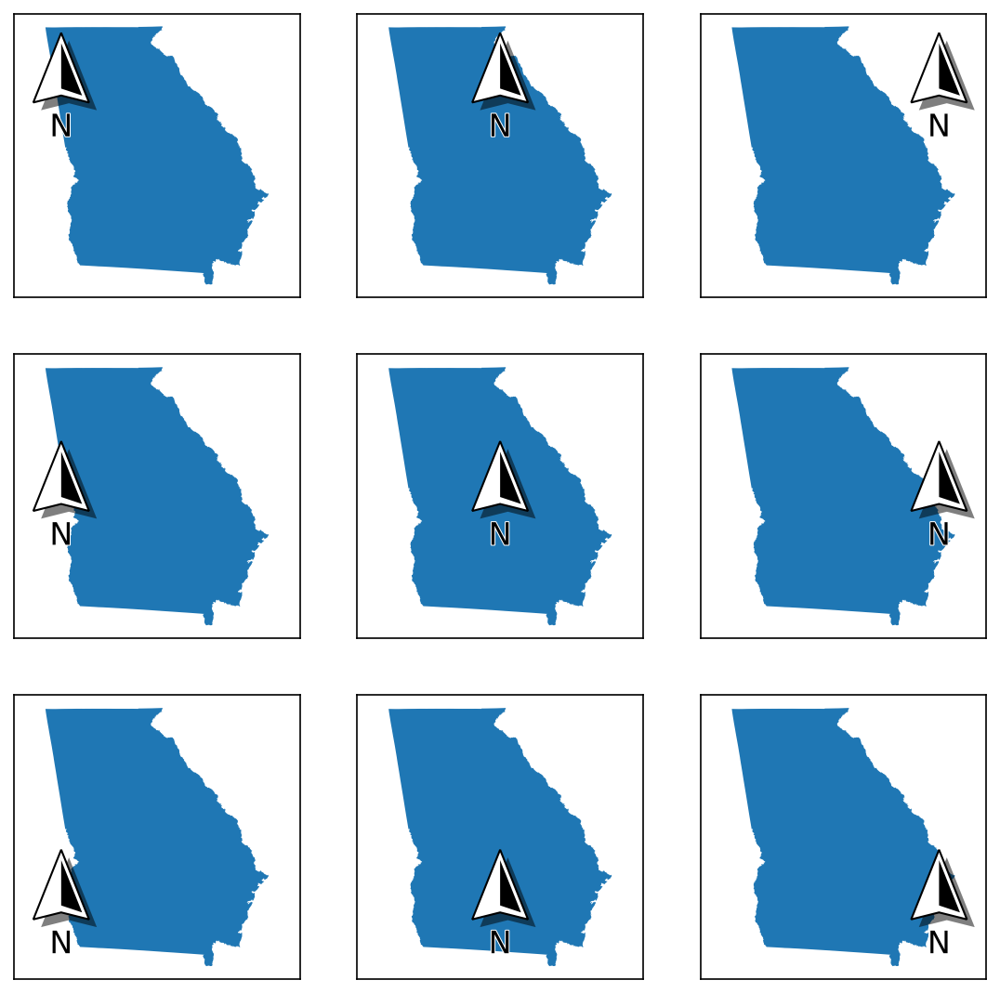
		

=== "Scales"

	```python
	# Modifying the scale
	# Recommend looking at the "Setting Size" section of "Tips and Tricks" for another way to do this!
	scales = [0.25, 0.5, 1, 2]
	
	# Creating four subplots
	fig, axs = new_map(1,4, figsize=(20,5))
	
	for ax,s in zip(axs.flatten(), scales):
		states.query(f"NAME=='Georgia'").plot(ax=ax)
		ax.set_aspect(1, adjustable="datalim")
		north_arrow(ax=ax, location="upper right", rotation={"degrees":0}, scale=s)
	```
		
	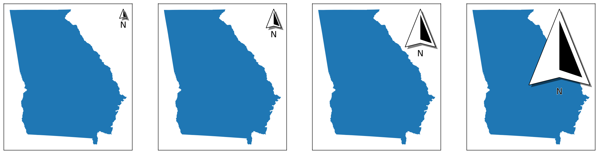

=== "ZOrder"
	```python
	# An example to show changing zorders
	zorders = [{"plot":5,"arrow":10}, {"plot":10,"arrow":5}]
	
	# Creating four subplots
	fig, axs = new_map(1,2, figsize=(10,5))
	
	for ax,z in zip(axs.flatten(), zorders):
		states.query(f"NAME=='Georgia'").plot(ax=ax, zorder=z["plot"])
		ax.set_aspect(1, adjustable="datalim")
		north_arrow(ax=ax, location="upper left", rotation={"degrees":0}, zorder=z["arrow"])
	```

	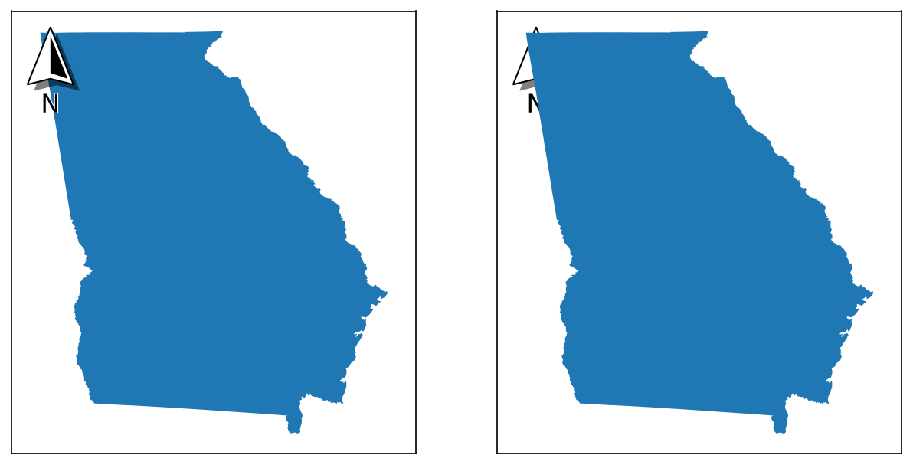

### Visible Components
There are four "visible" components to the north arrow. Each of these is separately customisable, and can be turned off entirely by passing a value of `False` to the function or object creation (passing `None` uses default values).

#### Base
`base` is the bottom-most visible layer and the most important component. 

| Attribute | Description | Accepts |
| :--- | :--- | :--- |
| `coords` | The coordinates used to draw the shape of the base itself. Each coordinate exists on a plane from 0 to 1 in two dimensions (`[0,0]` being bottom-left and `[1,1]` being top-right, in the format `[x,y]`), and is multiplied by `scale` to get its corresponding size in inches. | A `numpy.array` of two-element tuples |
| `facecolor` | The color of the main base patch. | Any `matplotlib` color |
| `edgecolor` | The color of the edge of the base patch. | Any `matplotlib` color |
| `linewidth` | The width of the edge of the base patch. | Any positive number |
| `zorder` | The drawing order of the base patch. Recommended to be a lower number than the fancy patch. Is relative to the other artists that comprise the north arrow (label, fancy), NOT to the overall plot. | Any positive number |

```python
# Modifying specific elements
modifications = [
	{"facecolor":"cyan"}, # changing the color
	{"edgecolor":"red"}, # changing the color
	{"linewidth":6}, # changing the stroke
	False # hiding it entirely - note that the shadow is hidden here too, as it is dependent on the base artist for visibility
]

# Creating four subplots
fig, axs = new_map(1,4, figsize=(20,5))

for ax,m in zip(axs.flatten(), modifications):
	states.query(f"NAME=='Georgia'").plot(ax=ax)
	ax.set_aspect(1, adjustable="datalim")
	north_arrow(ax=ax, location="upper right", rotation={"degrees":0}, base=m)
```

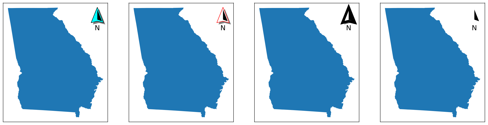

#### Fancy
`fancy` is the half-shape patch on top of the `base` (in the examples above, it appears as black). 

| Attribute | Description | Accepts |
| :--- | :--- | :--- |
| `coords` | The coordinates used to draw the shape of the patch itself | See the same option on the `base` component for details (above) |
| `facecolor` | The color of the patch. | Any `matplotlib` color |
| `zorder` | The drawing order of the patch. Recommended to be a higher number than the `base` patch. Is relative to the other artists that comprise the north arrow (label, base), NOT to the overall plot. | Any positive number |

```python
# Modifying specific elements
modifications = [
	True, # normal patch
	{"coords":numpy.array([(0.50, 0.85), (0.35, 0.50), (0.50, 0.55), (0.65, 0.50), (0.50, 0.85)])}, # changing the shape
	{"facecolor":"blue"}, # changing the color
	False # hiding it entirely
]

# Creating four subplots
fig, axs = new_map(1,4, figsize=(20,5))

for ax,m in zip(axs.flatten(), modifications):
	states.query(f"NAME=='Georgia'").plot(ax=ax)
	ax.set_aspect(1, adjustable="datalim")
	north_arrow(ax=ax, location="upper right", rotation={"degrees":0}, fancy=m)
```


#### Label
`label` is the text that appears appears around the arrow.

| Attribute | Description | Accepts |
| :--- | :--- | :--- |
| `text` | The text that will be displayed. | Any string |
| `position` | The position of the text relative to the arrow itself. | Any of `top`, `bottom`, `left`, or `right` |
| `ha` | How the text is positioned horizontally - see `matplotlib` documentation for more details. | Any of `left`, `center`, or `right` |
| `va` | How the text is positioned vertically - see `matplotlib` documentation for more details. | Any of `baseline`, `bottom`, `center`, `center_baseline`, or `top` |
| `fontsize` | The size of the text - see `matplotlib` documentation for more details. | Any number, or a string such as `small` or `xx-large` |
| `fontfamily` | The appearance of the text - see `matplotlib` documentation for more details. | Any of `serif`, `sans-serif`, `cursive`, `fantasy`, or `monospace` |
| `fontstyle` | The appearance of the text - see `matplotlib` documentation for more details. | Any of `normal`, `italic`, or `oblique` |
| `color` | The color of the main text. | Any `matplotlib` color |
| `fontweight` | The appearance of the text - see `matplotlib` documentation for more details. | Any of `normal`, `bold`, `heavy`, `light`, `ultrabold`, or `ultralight` |
| `stroke_width` | The width of the outline of the text | Any positive number |
| `stroke_color` | The color of the outline of the text | Any `matplotlib` color |
| `rotation` | The rotation of the text _centrally_. Note that this works differently than the `rotation` of the arrow itself (see the appropriate section under *Formatting Components*) | Any number |
| `zorder` | The drawing order of the text patch, relative to the other artists that comprise the north arrow (base, fancy), NOT to the overall plot. | Any number |

```python
# Modifying specific elements
modifications = [
	{"text": "North"}, # changing the text
	{"position": "left"}, # changing the position
	{"fontsize": 30}, # changing the size
	{"fontfamily": "cursive"}, # changing the family
	{"color": "cyan"}, # changing the color of the text
	{"stroke_width": 5, "stroke_color": "red"}, # changing the stroke size and color
	{"rotation": 30}, # changing the rotation
	False # hiding it entirely
]

# Creating eight subplots
fig, axs = new_map(2,4, figsize=(20,10))

for ax,m in zip(axs.flatten(), modifications):
	states.query(f"NAME=='Georgia'").plot(ax=ax)
	ax.set_aspect(1, adjustable="datalim")
	north_arrow(ax=ax, location="upper right", rotation={"degrees":0}, label=m)
```

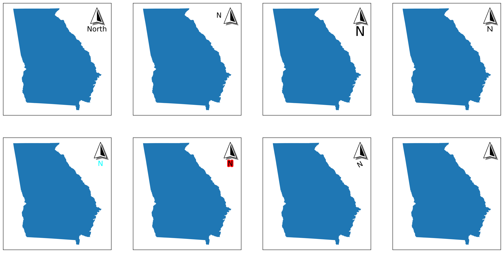

#### Shadow
`shadow` is the path effect on the `base` patch that creates the shadow effect - it is applied using [`matplotlib.patheffects.withSimplePatchShadow`](https://matplotlib.org/stable/api/patheffects_api.html#matplotlib.patheffects.SimplePatchShadow).

| Attribute | Description | Accepts |
| :--- | :--- | :--- |
| `offset` | Where the shadow appears relative to the base patch. | A tuple of coordinates in the order `(x,y); each coordinate can be either a float or an integer |
| `alpha` | The transparency of the shadow patch. | A number between 0 and 1 |
| `shadow_rgbFace` | The color of the shadow patch. | Any `matplotlib` color value |

```python
# Modifying specific elements
modifications = [
	{"offset": (4, -4)}, # changing the offset
	{"offset": (4, 4)}, # changing the offset
	{"offset": (-4, 4)}, # changing the offset
	{"offset": (-4, -4)}, # changing the offset
	{"alpha": 0.2}, # changing the transparency
	{"alpha": 0.8}, # changing the transparency
	{"shadow_rgbFace": "red"}, # changing the color
	False # hiding it entirely
]

# Creating eight subplots
fig, axs = new_map(2,4, figsize=(20,10))

for ax,m in zip(axs.flatten(), modifications):
	states.query(f"NAME=='Georgia'").plot(ax=ax)
	ax.set_aspect(1, adjustable="datalim")
	north_arrow(ax=ax, location="upper right", rotation={"degrees":0}, shadow=m)
```

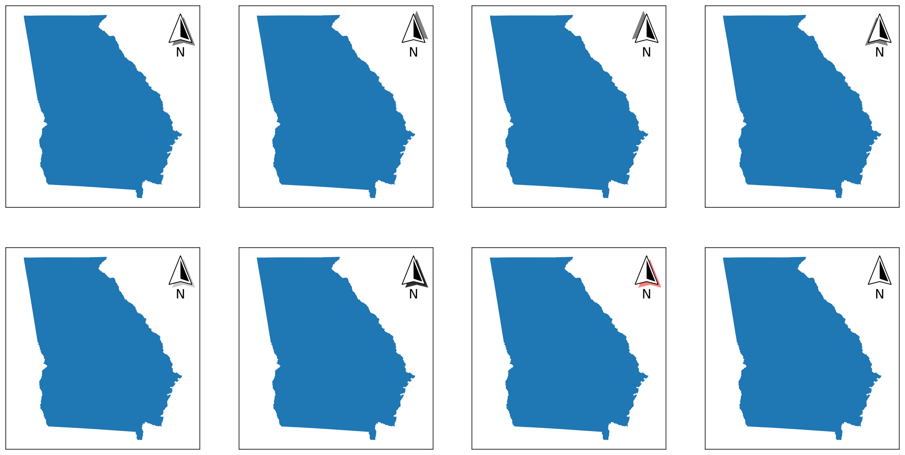

### Formatting Components
There are three "invisible" components to the north arrow - so called because they are mainly there to help position the arrow and its individual components. Unlike the "visible" components, these cannot be turned off, but they are still separately customisable.

#### Pack
`pack` customizes the [`HPacker`](https://matplotlib.org/stable/api/offsetbox_api.html#matplotlib.offsetbox.HPacker) or [`VPacker`](https://matplotlib.org/stable/api/offsetbox_api.html#matplotlib.offsetbox.VPacker) object that handles the positioning of the `label` relative to the `base` patch (and `fancy` patch if it is included). Whether or not it is an `HPacker` or `VPacker` is used is dependent on the `position` option from the `label`, but the settings are the same for both.

| Attribute | Description | Accepts |
| :--- | :--- | :--- |
| `offset` | Where the shadow appears relative to the base patch. | A tuple of coordinates in the order `(x,y); each coordinate can be either a float or an integer |
| `alpha` | The transparency of the shadow patch. | A number between 0 and 1 |
| `shadow_rgbFace` | The color of the shadow patch. | Any `matplotlib` color value |

| `sep` | The amount of spacing to have *between the elements*, in points. | Any positive number |
| `align` | How each element is aligned. | Any of `top`, `bottom`, `left`, `right`, `center`, or `baseline` |
| `pad` | The amount of padding around the box, in points. *Note that this is usually kept at 0, and controlled instead using the `aob` settings (below).* | Any positive number |
| `width` and `height` | The dimensions of the box, in pixels. *Kept as `None` for most circumstances so calculated manually.* | Any positive number |
| `mode` | How the elements are packed within the box; see documentation for `HPacker` and `VPacker` as to how each mode works. | Any of `fixed`, `expand`, or `equal`; *default is `fixed`. |

```python
# Modifying specific elements
modifications = [
	None, # default settings
	{"sep": 15}, # increased separation between items
	{"align": "left"}, # changing the alignment of items
	{"width": 100, "height": 200, "mode": "expand"}, # changing the mode, not a great example
]

# Creating four subplots
fig, axs = new_map(1,4, figsize=(20,5))

for ax,m in zip(axs.flatten(), modifications):
	states.query(f"NAME=='Georgia'").plot(ax=ax)
	ax.set_aspect(1, adjustable="datalim")
	north_arrow(ax=ax, location="upper right", rotation={"degrees":0}, pack=m)
```

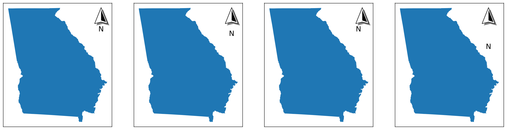

#### AOB
`aob` customizes the [`AnchoredOffsetBox`](https://matplotlib.org/stable/api/offsetbox_api.html#matplotlib.offsetbox.AnchoredOffsetbox) object that handles the positioning of the final north arrow object with respect to the *plot*. Note that `facecolor`, `edgecolor`, and `alpha` are non-standard options.

| Attribute | Description | Accepts |
| :--- | :--- | :--- |
| `facecolor` | The color of the `AnchoredOffsetBox` patch. | Any `matplotlib` color |
| `edgecolor` | The color of the edge of the `AnchoredOffsetBox` patch. | Any `matplotlib` color |
| `alpha` | The transparency of the `AnchoredOffsetBox` patch. | Any `matplotlib` color |
| `pad` | The amount of padding around the north arrow, defining the edges of the `AnchoredOffsetBox`. Expressed as *a fraction of the fontsize specified in `prop`*. | Any positive number |
| `borderpad` | The amount of padding between the `AnchoredOffsetBox` and the `bbox_to_anchor`, if one is specified. Expressed as *a fraction of the fontsize specified in `prop`*. | Any positive number |
| `prop` | A reference fontsize used to define the paddings of `pad` and `borderpad`. | Any valid fontsize input |
| `frameon` | Whether or not to draw a frame around the box. | Either `True` or `False` |
| `bbox_to_anchor` and `bbox_transform` | Used to customize the placement of the `AnchoredOffsetBox`. | See *Tips and Tricks* section for details |

```python
# Modifying specific elements
modifications = [
	{"facecolor": "black"}, # different facecolor
	{"edgecolor": "red"}, # different edgecolor
	# these two show the difference between pad and borderpad
	{"edgecolor": "red", "pad": 3}, # increased pad
	{"edgecolor": "red", "borderpad": 3}, # increased borderpad
]

# Creating four subplots
fig, axs = new_map(1,4, figsize=(20,5))

for ax,m in zip(axs.flatten(), modifications):
	states.query(f"NAME=='Georgia'").plot(ax=ax)
	ax.set_aspect(1, adjustable="datalim")
	north_arrow(ax=ax, location="upper right", rotation={"degrees":0}, aob=m)
```

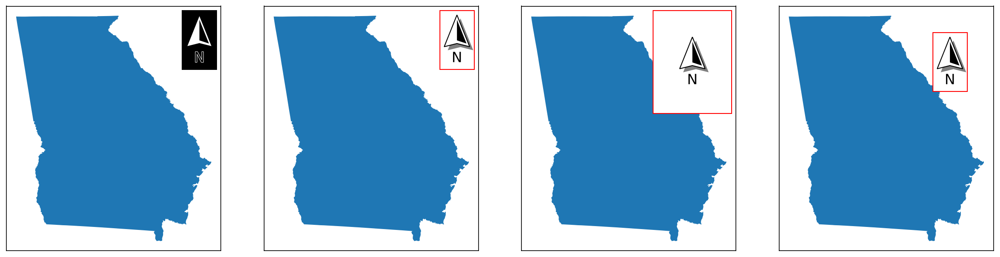

#### Rotation
`rotation` controls how the north arrow is rotated so that it points upwards (towards true north). There are two ways to customize this:

=== "Automatic Calculation"

	If the direction to north is *not* known, it can be automatically calcuated with three pieces of information:

	| Attribute | Description | Accepts |
	| :--- | :--- | :--- |
	| `crs` | The coordinate reference system that the map is in. | Any `pyproj` CRS value (including strings and integers) |
	| `reference` | The *type* of reference point from which north will be calcualted. | Any of `axis`, `data`, or `center` |
	| `coords` | A tuple of coordinates from which north will be calculated. | Each coordinate can be either a float or an integer |
		
	* If `reference` is `axis`, then `coords` should be in *axis* coordinates, where `(0,0)` represents the bottom-left point of the plot, and `(1,1)` represents the top-right point of the plot.
	
	* If `reference` is `data`, then `coords` should be in *data* coordinates, meaning that of the CRS supplied by `crs`.
	
	* If `reference` is `center`, then a value of `coords` is not necessary - it is the equivalent of setting `reference` to `axis` and `coords` to `(0.5, 0.5)`. This is how most common software such as ArcGIS Pro and QGIS calculate the rotation of the north arrow.

	```python
	# Demonstrating how the rotation changes based on the reference point
	modifications = [
		["lower left", {"crs":3520, "reference":"axis", "coords":(0.1, 0.1)}],
		["upper left", {"crs":3520, "reference":"axis", "coords":(0.1, 0.9)}],
		["upper right", {"crs":3520, "reference":"axis", "coords":(0.9, 0.9)}],
		["lower right", {"crs":3520, "reference":"axis", "coords":(0.9, 0.1)}],
	]
	
	# Creating a single plot for the contiguous USA
	to_exclude = ['Hawaii','Alaska','Guam','Commonwealth of the Northern Mariana Islands','United States Virgin Islands','American Samoa','Puerto Rico']
	
	fig, ax = new_map(1,1, figsize=(4,6))
	
	# Note that I'm using a CRS here that will create rotations explicitly! 3520 is really only suitable for Georgia.
	states.query(f"NAME not in {to_exclude}").to_crs(3520).plot(ax=ax)
	
	for m in modifications:
		north_arrow(ax=ax, location=m[0], rotation=m[1])
	```

	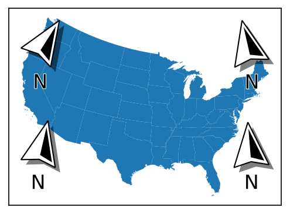

=== "Manual Control"

	| Attribute | Description | Accepts |
	| :--- | :--- | :--- |
	| `degrees` | If a value is passed, the arrow will simply be rotated to that point; this can be used to point to other directions is necessary, or if the direction to north is known. | A number between -360 and 360 |

---

## Tips and Tricks

### Setting Size
While the north arrow can nominally have its size changed by changing the `scale` attribute, doing so doesn't change the other, related components, such as the sizes of the text, the shadow's offset, the stroke widths, and so on.

However, given that there are standardized paper sizes that most graphics are made towards, a `size` parameter is available that will select pre-configured default values that approximate what looks best at each size. The parameter takes in only one input, which is the size tier you want:

* `xsmall` or `xs` for A8 paper, ~2 to 3 inches

* `small` or `sm` for A6 paper, ~4 to 6 inches

* `medium` or `md` for A4 or letter paper, ~8 to 11 inches

* `large` or `lg` for A2 paper, ~16 to 24 inches

* `xlarge` or `xl` for A0 paper, ~33 to 48 inches

These default values can be seen in `defaults/north_arrow.py`.

```python
# Creating an empty plot - for reference, this is 10 inches x 5 inches
fig, ax = new_map(1,1, figsize=(10,5))

# Visualizing the different sizes at various positions
for l,s in zip([0.1, 0.2, 0.35, 0.55, 0.85], ["xs","sm","md","lg","xl"]):
	# Using the size parameter to set the size directly
	north_arrow(ax=ax, size=s, location="center", label={"text":s}, rotation={"degrees":0}, aob={"bbox_to_anchor":(l, 0.5), "bbox_transform":ax.transAxes})
```
		
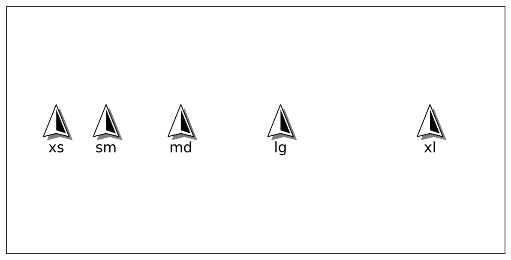

### Placing Arrows Outside of Axis
Sometimes it is more desireable to place the arrow outside of the plot entirely, which can be accomplished using `bbox_to_anchor` and `bbox_transform` from the `aob`component settings. This works the same way it does for [`matplotlib.pyplot.legend`](https://matplotlib.org/stable/api/_as_gen/matplotlib.pyplot.legend.html#matplotlib.pyplot.legend).


```python
fig, ax = new_map()

states.query("NAME=='Georgia'").plot(ax=ax)

north_arrow(ax=ax, size="sm", location="upper left", rotation={"degrees":0}, aob={"bbox_to_anchor":(1.05,1), "bbox_transform":ax.transAxes})
```

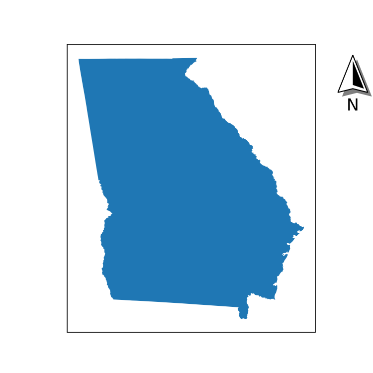