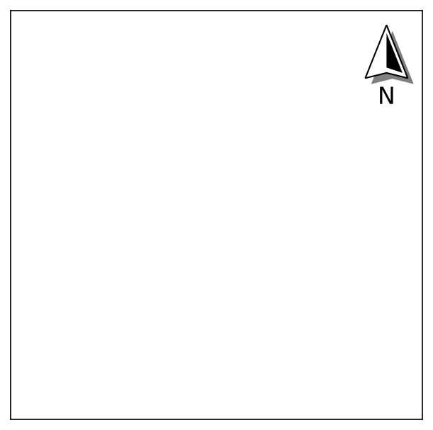
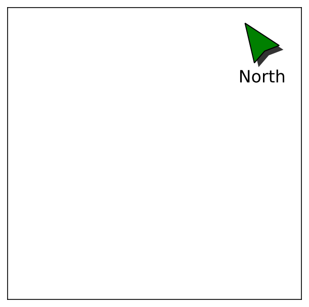
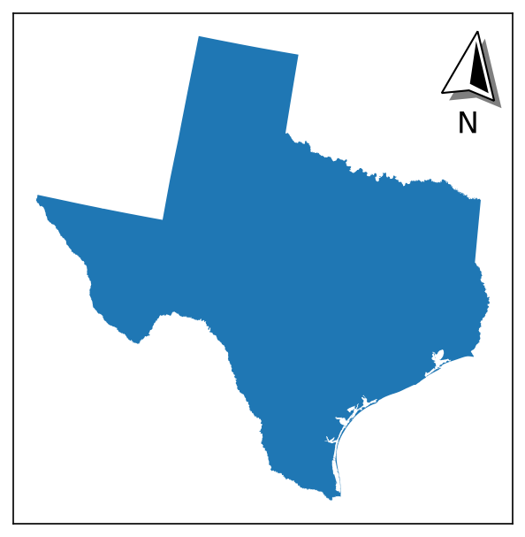
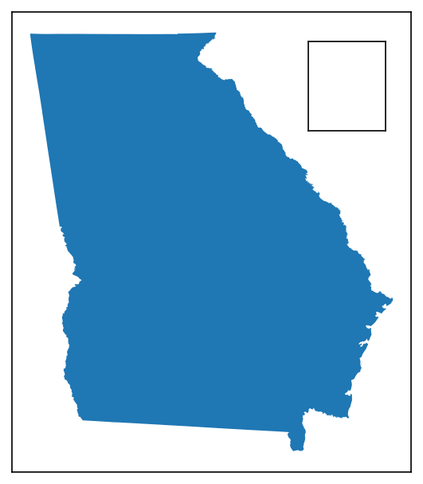
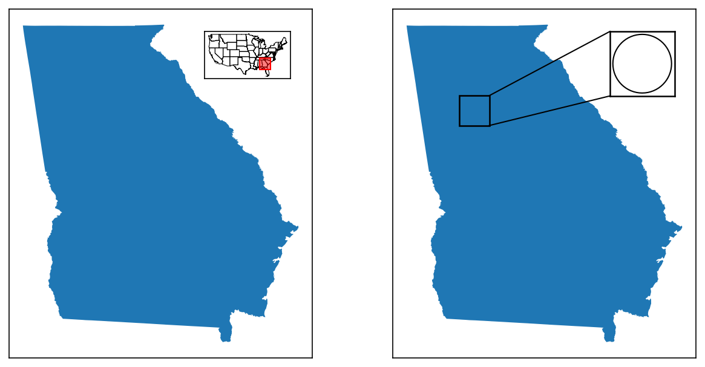

## Map Elements

The three _map element_ features (north arrows, scale bars, and inset maps) share a common import structure, where any of the following can work (example shown for north arrows):

```py
from matplotlib_map_utils import NorthArrow, north_arrow
from matplotlib_map_utils.core import NorthArrow, north_arrow # also valid
from matplotlib_map_utils.core.north_arrow import NorthArrow, north_arrow # also valid
```

There is no difference in where you import from, so for brevity's sake the documentation uses the first, shortest example.

---

Similarly, all three of the map elements support both a <em class="emphasis-ac">functional</em> and <em class="emphasis-fg">object-oriented</em> approach, like:

=== "Functional"
	```py
	# Setting up a plot
	fig, ax = matplotlib.pyplot.subplots(1,1, figsize=(5,5), dpi=150)
	
	# Adding a north arrow to the upper-right corner of the axis, without any rotation 
	# (see Rotation under Formatting Components for details)
	north_arrow(ax=ax, location="upper right", rotation={"degrees":0})
	```

=== "Object-Oriented"
	```py
	# Setting up a plot
	fig, ax = matplotlib.pyplot.subplots(1,1, figsize=(5,5), dpi=150)
	
	# Creating a north arrow for the upper-right corner of the axis, without any rotation 
	# (see Rotation under Formatting Components for details)
	na = NorthArrow(location="upper right", rotation={"degrees":0})
	
	# Adding the artist to the plot
	ax.add_artist(na)
	```

The primary difference between the functional and object-oriented approaches is that <span class="strong-fg">the latter allows from the creation of _reusable_ elements - useful if you are making many plots at once</span>; otherwise, all customisation options are the same. Again, for brevity's sake, only the functional approaches will be demonstrated in this guide, but the object-based approach will be shown in the detailed guides specific to each element.

??? warning "Expect Future Changes!"
	Currently, using an object-oriented approach for north arrows and scale bars requires a slight "hack" to preserve re-usability while calling `add_artist()`, which is explained in their respective guides; I am considering making a breaking change to a future version of the package so that north arrows and scale bars follow the approach taken instead by inset maps, which does not use `add_artist()` but provides a similar mechanism for applying the artist to the plot.

---

Generally, each map element should be added as the _final step before rendering the plot_: most elements rely on aspects of the plot such as the axis limits and figure size having been appropriately calculated in order to format themselves properly.

```py
# Setting up a plot
# The figsize and DPI here should NOT be changed after adding elements
fig, ax = matplotlib.pyplot.subplots(1,1, figsize=(5,5), dpi=150)

# Here, you would add your geodata, change your limits, and so on
gdf.plot(...)
ax.set_xlim(...)
ax.set_ylim(...)

# Only after all of this was done would you add each of your elements
north_arrow(ax=ax, ...)
scale_bar(ax=ax, ...)
```

---

### :lucide-mouse-pointer-2: North Arrows

A basic north arrow can be generated by providing two pieces of information

- The `location` of the plot where you want the north arrow to appear
- The `rotation` you want the north arrow to have; here a manual rotation of 0 degrees is provided

```python
from matplotlib_map_utils import north_arrow

# Setting up a plot
fig, ax = matplotlib.pyplot.subplots(1,1, figsize=(5,5), dpi=150)

# Adding a north arrow to the upper-right corner of the axis, without any rotation 
# (see Rotation, below, for details)
north_arrow(ax=ax, location="upper right", rotation={"degrees":0})
```
This will create an output like the following:



#### Customization

Most aspects of the north arrow can be customised, or turned off entirely:

```python
north_arrow(
	ax,
	location = "upper right", # accepts a valid string from the list of locations
	scale = 0.5, # accepts a valid positive float or integer
	# each of the follow accepts arguments from a customised style dictionary
	base = {"facecolor":"green"},
	fancy = False,
	label = {"text":"North"},
	shadow = {"alpha":0.8},
	pack = {"sep":6},
	aob = {"pad":2},
	rotation = {"degrees": 35}
)
```

This will create an output like the following:



Refer to [the North Arrows guide](/north_arrows) for details on how to customise each facet of the north arrow. 

#### Rotation

The north arrow object is also capable of pointing towards "true north", given a CRS and reference point:



Refer to [this subheader of the North Arrows guide](/north_arrows#rotation) for details on how to do so. 

---

### :lucide-ruler: Scale Bars

A basic scale bar can be generated by providing three pieces of information

- The `location` of the plot where you want the scale bar to appear
- The `style` of scale bar (either `boxes` or `ticks`)
- Information that tells the scale bar its length (on the plot) and its units (based on what is being plotted)
	- This can get somewhat complicated - see [the _Specifying Length_ section](#specifying-length) below for details

```python
from matplotlib_map_utils import scale_bar

# Setting up a plot
fig, ax = matplotlib.pyplot.subplots(1,1, figsize=(5,5), dpi=150)

# Adding a scale bar to the upper-right corner of the axis, 
# in the same projection as whatever geodata you plotted
scale_bar(ax=ax, location="upper right", style="boxes", bar={"projection":3857})
```
This will create an output like the following (note: both `boxes` and `ticks` styles are shown):


#### Customization

Most aspects of the scale bar can be customised, or turned off entirely:

```python
scale_bar(
	ax,
	location = "upper right", # accepts a valid string from the list of locations
	style = "boxes", # accepts a valid positive float or integer
	# each of the follow accepts arguments from a customised style dictionary
	bar = {"unit":"mi", "length":2}, # converting the units to miles, and changing the length of the bar (in inches)
	labels = {"style":"major", "loc":"below"}, # placing a label on each major division, and moving them below the bar
	units = {"loc":"text"}, # changing the location of the units text to the major division labels
	text = {"fontfamily":"monospace"}, # changing the font family of all the text to monospace
)
```

This will create an output like the following:


Refer to [the Scale Bars guide](/scale_bars) for details on how to customise each facet of the scale bar. 

#### Specifying Length

=== "Physical / Plot Length"
	`length` is used to set the total length of the bar, either in _inches_ (for values >= 1) or as a _fraction of the axis_ (for values < 1).

	- The default value of the scale bar utilizes this method, with a `length` value of `0.25` (meaning 25% of the axis).
	- It will automatically orient itself against the horizontal or vertical axis when calculating its fraction, based on the value supplied for `rotation`.
	- Values `major_div` and `minor_div` are ignored, while a value for `max` will _override_ `length`.

	!!! warning
		Note that any values here will be rounded to a "nice" whole integer, so the length will *always be approximate*; ex., if two inches is 9,128 units, your scale bar will end up being 9,000 units, and therefore a little less than two inches.

=== "Maximum Units"
	`max` is used to define the total length of the bar, _in the same units as your map_, as determined by the value of `projection` and `unit`.

	- Ex: If you are using a projection in feet, and give a `max` of `1000`, your scale bar will be representative of 1,000 feet.
	- Ex: If you are using a projection in feet, but provide a value of `meter` to `unit`, and give a `max` of `1000`, your scale bar will be representative of 1,000 meters.
	- Will _override_ any value provided for `length`, and give a warning that it is doing so!
	- Values can be optionally be provided for `major_div` and `minor_div`, to subdivide the bar into major or minor segments as you desire; if left blank, values for these will be calculated automatically (see `preferred_divs` in `validation/scale_bar.py` for the values used).

=== "Major Divison"
	`major_mult` can be used alongside `major_div` to _derive_ the total length: `major_mult` is the _length of a **single** major division_, in the _same units as your map_ (as determined by the value of `projection` and `unit`), which is then multiplied out by `major_div` to arrive at the desired length of the bar.

	- Ex: If you set `major_mult` to 1,000, and `major_div` to 3, your bar will be 3,000 units long, divided into three 1,000 segments.
	- This is the _only_ use case for `major_mult` - using it anywhere else will result in warnings and/or errors!
	- Specifying either `max` or `length` will override this method!
	- `minor_div` can still be _optionally_ provided.

Refer to [this subheader of the Scale Bars guide](/scale_bars#specifying-length) for further details on how to specify the length of the scale bar, including detail on using custom units. 

---

### :lucide-picture-in-picture-2: Inset Maps

A basic inset map can be generated by providing three pieces of information

- The `location` of the plot where you want the inset map to appear
- The `size` of the inset map, in inches (providing a single number creates a square plot)

```python
from matplotlib_map_utils import inset_map

# Setting up a plot
fig, ax = matplotlib.pyplot.subplots(1,1, figsize=(5,5), dpi=150)

# Adding an inset map to the axis
# Here, we also pass some additional kwargs argument that would be accepted by a "normal" axis
iax = inset_map(ax=ax, location="upper right", size=0.75, pad=0, xticks=[], yticks=[])
# Note that we have a returned object, which acts as a separate axis
# Meaning you can plot further objects to it, ex. gdf.plot(ax=iax)
```
This will create an output like the following:



Refer to [the Inset Maps guide](/inset_maps) for details on how to customise each facet of the inset map. 

#### Extent and Detail Indicators

Inset maps can be paired with either an extent or detail _indicator_, to provide additional geographic context to the inset map:

```python
indicate_extent(inset_axis, parent_axis, inset_crs, parent_crs, ...)
indicate_detail(parent_axis, inset_axis, parent_crs, inset_crs, ...)
```

These will create an output like the following (extent indicator on the left, detail indicator on the right):



Refer to [the Indicators section of the Inset Maps guide](/inset_maps#inset-map-indicators) for further details. 

---

## :lucide-wrench: Utilities

As of `v2.1.0`, there is only one utility available: `USA`, an object to help quickly filter for subsets of US states and territories. This utility class is still in beta, and might change.

!!! question "Got An Idea?"
	If you've built out any custom mini scripts that help you make maps that you think might be useful to others, or if you simply have ideas for functions you would find useful, I'm very open to including them in this utility section - feel free to open an issue describing it, or author your own PR!

---

### USA

The `USA` class was built to provide an easy method of generating lists of FIPS codes for certain subsets of US states and territories (useful, for example, when querying or filtering a dataframe), and was expanded to then provide a general capacity of _enriching_ data related to US states and territories (for example, adding in regional/subregional groupings based on state names).

A small example showcasing how to import the utility class and use it:

```py
from matplotlib_map_utils.utils import USA

# Loading the object
usa = USA()

# Getting a list of FIPS codes for US States (not territories)
usa.filter(states=True, to_return="fips")

# Getting a list of State Names for states in the South and Midwest regions
usa.filter(region=["South","Midwest"], to_return="name")
```

Refer to [the USA section of the Utilities guide](/utilities#usa) for details on how to use this class, including with `pandas.apply()`.