This guide is structured like a tutorial, in order to showcase the various options and methods available; if you would like to follow along, a few additional packages and set-up steps are required:

## Set-Up

```python
# Packages used by this tutorial
import geopandas # manipulating geographic data
import numpy # creating arrays
import pygris # easily acquiring shapefiles from the US Census
import matplotlib.pyplot # visualization

# Downloading the state-level dataset from pygris
states = pygris.states(cb=True, year=2022, cache=False).to_crs(3857)

# This is just a function to create a new, blank map with matplotlib, with our default settings
def new_map(rows=1, cols=1, figsize=(5,5), dpi=150, ticks=False):
	# Creating the plot(s)
	fig, ax = matplotlib.pyplot.subplots(rows,cols, figsize=figsize, dpi=dpi)
	# Turning off the x and y axis ticks
	if ticks==False:
		if rows > 1 or cols > 1:
			for a in ax.flatten():
				a.set_xticks([])
				a.set_yticks([])
		else:
			ax.set_xticks([])
			ax.set_yticks([])
	# Returning the fig and ax
	return fig, ax
```

The above is only necessary for this specific tutorial; below, we import the main elements related to scale bars:

```py
# Importing the main package
from matplotlib_map_utils import ScaleBar, scale_bar
```

---

## Creating a Scale Bar

??? warning "Don't Change Figure DPI After Creation"

	Your desired DPI *must* be set upon creation of the subplots/axes (ex., when calling `matplotlib.pyplot.subplots(... dpi=##)`), and *not* changed when saving the figure (e.x. when calling `matplotlib.pyplot.savefig(... dpi=##)`). This is because the scale bar is rasterized to match the current DPI of the figure upon creation - changing it later will mess up the scale and make the bar blurry (see [this issue](https://github.com/moss-xyz/matplotlib-map-utils/issues/7) for more details).

### Using the `scale_bar()` function
The quickest and easiest way to add a scale bar to a single plot is using the `scale_bar()` function. This will automatically create the artist _and_ apply it to the supplied axis.

```python
# Setting up a plot
fig, ax = new_map()

# Plotting a state (Georgia)
states.query("NAME=='Georgia'").plot(ax=ax)

# Adding a scale_bar to the upper-right corner of the axis - note that bar['projection'] MUST be set for this to work
scale_bar(ax=ax, location="upper right", style="boxes", bar={"projection":3857,"minor_type":"none"}, labels={"style":"first_last"})
```


### Using the ``ScaleBar`` class
Alternatively, a `ScaleBar` class (based on `matplotlib.artist.Artist`) is also provided that allows the same bar to be rendered like so:

```python
# Setting up a plot
fig, ax = new_map()

# Plotting a state (Georgia)
states.query("NAME=='Georgia'").plot(ax=ax)

# Creating a ScaleBar object that we want to place in the upper-right corner of the axis, 
# Note that here, we do not specify the axis
sb = ScaleBar(location="upper right", style="ticks", bar={"projection":3857,"minor_type":"none"}, labels={"style":"first_last"})

# The ScaleBar can then be added using add_artist(), which calls its built-in draw() function:
ax.add_artist(sb)
```


#### Re-using Objects
The benefit of the `ScaleBar` object is that <span class="strong-fg">it can be re-used across multiple plots without copy-pasting the function call</span>. This is particularly beneficial for highly-customized bars: you can simply set it up once, and then add it to each axis you want.

The caveat to this is that instead of using `ax.add_artist(ScaleBar)`, you have to use `ax.add_artist(ScaleBar.copy())`; as `matplotlib` does not let you add the same artist to multiple axes, you have to add a *copy* of the artist.

=== "Invalid"
	Here, we try and re-use the `sb` artist we created above, which has already been applied to the plot of Georgia
	```python
	# Setting up a plot
	fig, ax = new_map()
	
	# Plotting a new state (Texas)
	states.query("NAME=='Texas'").plot(ax=ax)
	
	# Trying to re-use the same artist - this will throw an error
	ax.add_artist(sb)
	```

	Returns:
	```py
	ValueError Can not reset the Axes. You are probably trying to reuse an artist in more than one Axes which is not supported
	```

=== "Valid"
	Now, we're starting from scratch:
	```python
	# Setting up plots for both Georgia and Texas
	ga_fig, ga_ax = new_map()
	tx_fig, tx_ax = new_map()
	
	# Plotting each state
	states.query("NAME=='Georgia'").plot(ax=ga_ax)
	states.query("NAME=='Texas'").plot(ax=tx_ax)

	# Setting up the scale bar artist 
	sb = ScaleBar(location="upper right", style="boxes", bar={"projection":3857,"minor_type":"none"}, labels={"style":"first_last"})

	# Applying the artist to each plot
	# Note we have to call .copy() EACH TIME
	ga_ax.add_artist(sb.copy())
	tx_ax.add_artist(sb.copy())
	```

	Returns:
	<div class="grid cards" markdown>
	
	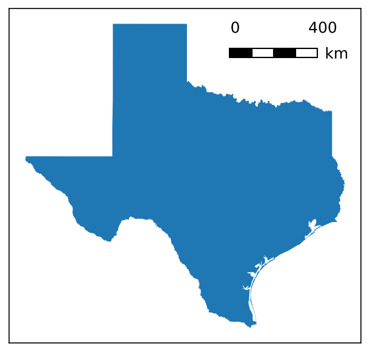
	</div>

As you can see from the valid example, the bar updates its context across each plot it is applied to - the length and divisions updated to reflect the fact that Texas is a bigger state, but the formatting and appearance stayed the same.

#### Updating Objects
The customization options of the `ScaleBar` can be accessed using dot notation (like `sb.base`, `sb.label`, etc.). They can also be updated from this dot notation by passing a valid style dictionary (see next section for details).

=== "Accessing Values"
	```python
	# Showing the labels style options
	sb.labels
	```

	Returns:
	```py
	{'style': 'first_last'}
	```

=== "Updating Values"
	```python
	# Updating the label style option for "loc"
	sb.labels = {"loc":"above"}
	sb.labels
	```

	Returns:
	```py
	{'style': 'first_last', 'loc': 'above'}
	```

This means you can update the properties of the created class while it is in use, in case you want small changes made in between iterations:

```python
shapes = ["Texas","Georgia","California","Louisiana"]
# What we'll be updating
families = ["serif", "cursive", "fantasy", "monospace"]

# Creating the initial bar
sb = ScaleBar(location="upper right", style="boxes", bar={"projection":3857,"minor_type":"none"}, labels={"style":"first_last"})

# Creating four subplots
fig, axs = new_map(1,4, figsize=(20,5))
for ax,s,f in zip(axs.flatten(), shapes, families):
	states.query(f"NAME=='{s}'").plot(ax=ax)
	ax.set_aspect(1, adjustable="datalim")
	sb.text = {"fontfamily":f}
	ax.add_artist(sb.copy())
```

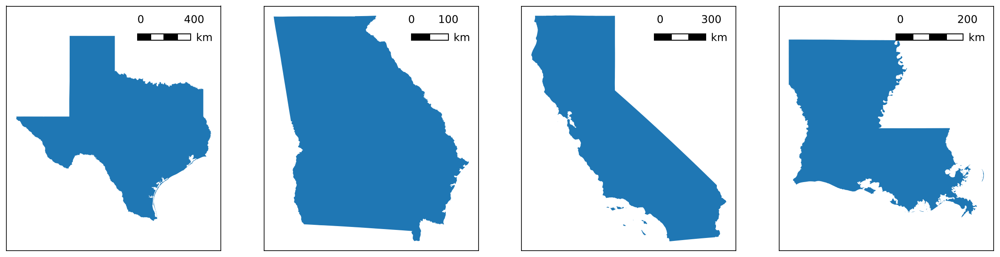

Though for this specific example, you could accomplish the same with the `scale_bar()` function just as (more?) easily

```python
shapes = ["Texas","Georgia","California","Louisiana"]
families = ["serif", "cursive", "fantasy", "monospace"]

# Creating four subplots
fig, axs = new_map(1,4, figsize=(20,5))

for ax,s,f in zip(axs.flatten(), shapes, families):
	states.query(f"NAME=='{s}'").plot(ax=ax)
	ax.set_aspect(1, adjustable="datalim")
	scale_bar(ax=ax, location="upper right", style="boxes", bar={"projection":3857,"minor_type":"none"}, labels={"style":"first_last"}, text={"fontfamily":f})
```
		


---

## Customizing the Scale Bar

Both the functional and object-oriented approach use the same primitive style dictionaries, so you can treat the following information as valid for both.

### Specifying Length

There are three main ways of specifying the length of a scale bar, which utilizes the `bar` argument of the construction function or class method (see under _Visible Components_, below):

=== "Physical / Plot Length"
	`length` is used to set the total length of the bar, either in _inches_ (for values >= 1) or as a _fraction of the axis_ (for values < 1).

	- The default value of the scale bar utilizes this method, with a `length` value of `0.25` (meaning 25% of the axis).
	- It will automatically orient itself against the horizontal or vertical axis when calculating its fraction, based on the value supplied for `rotation`.
	- Values `major_div` and `minor_div` are ignored, while a value for `max` will _override_ `length`.

	!!! warning
		Note that any values here will be rounded to a "nice" whole integer, so the length will *always be approximate*; ex., if two inches is 9,128 units, your scale bar will end up being 9,000 units, and therefore a little less than two inches.

=== "Maximum Units"
	`max` is used to define the total length of the bar, _in the same units as your map_, as determined by the value of `projection` and `unit`.

	- Ex: If you are using a projection in feet, and give a `max` of `1000`, your scale bar will be representative of 1,000 feet.
	- Ex: If you are using a projection in feet, but provide a value of `meter` to `unit`, and give a `max` of `1000`, your scale bar will be representative of 1,000 meters.
	- Will _override_ any value provided for `length`, and give a warning that it is doing so!
	- Values can be optionally be provided for `major_div` and `minor_div`, to subdivide the bar into major or minor segments as you desire; if left blank, values for these will be calculated automatically (see `preferred_divs` in `validation/scale_bar.py` for the values used).

=== "Major Divison"
	`major_mult` can be used alongside `major_div` to _derive_ the total length: `major_mult` is the _length of a **single** major division_, in the _same units as your map_ (as determined by the value of `projection` and `unit`), which is then multiplied out by `major_div` to arrive at the desired length of the bar.

	- Ex: If you set `major_mult` to 1,000, and `major_div` to 3, your bar will be 3,000 units long, divided into three 1,000 segments.
	- This is the _only_ use case for `major_mult` - using it anywhere else will result in warnings and/or errors!
	- Specifying either `max` or `length` will override this method!
	- `minor_div` can still be _optionally_ provided.

---

```python
# Creating three identical bars using the four different methods
# Grid of location options
# Note that the "center" options will feel slightly off: this is because the the center of the scale bar is of the entire artist, text included, not just the bar itself
bar_lengths = [
	{"length":0.5}, # this bar will be ~50% of the axis
	{"length":2}, # this bar will be ~2.5 inches
	{"max":300, "major_div":3}, # this bar will be 300 km (because EPSG:3857 is in meters)
	{"major_mult":100, "major_div":3}, # this bar will be 300 km (100 * 3 = 300)
]

fig, axs = new_map(1,4, figsize=(20,5))

for ax,l in zip(axs.flatten(), bar_lengths):
	states.query(f"NAME=='Georgia'").plot(ax=ax)
	ax.set_aspect(1, adjustable="datalim")
	scale_bar(ax=ax, location="center", style="boxes", bar={"projection":3857,"minor_type":"none"} | l, labels={"style":"first_last"})
```

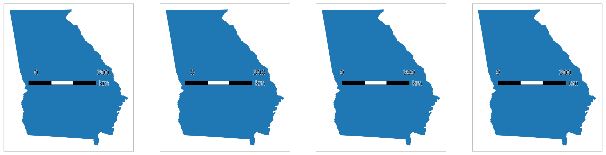
		
All of the above cases expect a valid CRS to be supplied to the `projection` parameter, to correctly calculate the relative size of the bar with respect to the map's underlying units. However, three _additional_ values may be passed to `projection`, to override this behavior entirely and directly set the dimensions of the bar, which can be useful for non-standard projections or for non-cartographic use cases:

??? info "Setting custom dimensions"

	- If `projection` is set to `px`, `pixel`, or `pixels`, then values for `max` and `major_mult` are interpreted as being in _pixels_ (so a `max` of 1,000 will result in a bar 1,000 pixels long)

	- If `projection` is set to `pt`, `point`, or `points`, then values for `max` and `major_mult` are interpreted as being in _points_ (so a `max` of 1,000 will result in a bar 1,000 points long (a point is 1/72 of an inch))

	- If `projection` is set to `dx`, `custom`, or `axis`, then values for `max` and `major_mult` are interpreted as being in _the units of the x or y axis_ (so a `max` of 1,000 will result in a bar equal to 1,000 units of the x-axis, if orientated horizontally)
	
	This alternative interface for defining the bar is inspired by the `dx` implementation of `matplotlib-scalebar`. _However_, this puts the onus on the user to know how big their bar should be - you also cannot pass a value to `unit` to convert! Note that you _can_ provide custom label text to the bar via the `labels` and `units` arguments (ex. if you need to label "inches" or something).


### Primary Settings
There are three primary settings that must be supplied each time a scale bar is created:

| Attribute | Description | Accepts |
| :--- | :--- | :--- |
| `location` | Where the bar will be placed relative to the plot. | Any options accepted by `matplotlib` for legend placement (`"upper right"`, `"center"`, `"lower left"`, etc., see *loc* in the [`matplotlib.pyplot.legend`](https://matplotlib.org/stable/api/_as_gen/matplotlib.pyplot.legend.html) documentation) |
| `style` | What you want the scale bar to look like. _Note that some options change depending on what you select here!_ | Either `boxes` (the default) or `ticks` |
| `zorder` | (new as of `v3.1.0`) The zorder of the final scale bar artist, which can be used to bring the artist forward / place it behind other axis artists. | Any number; default value is 99 |

=== "Locations"

	```python
	# Grid of location options
	# Note that the "center" options will feel slightly off: this is because the the center of the scale bar is of the entire artist, text included, not just the bar itself
	locs = ["upper left", "upper center", "upper right", "center left", "center", "center right", "lower left", "lower center", "lower right"]
	
	fig, axs = new_map(3,3, figsize=(9,9))
	
	for ax,l in zip(axs.flatten(), locs):
		states.query(f"NAME=='Georgia'").plot(ax=ax)
		ax.set_aspect(1, adjustable="datalim")
		scale_bar(ax=ax, size="xs", location=l, style="boxes", bar={"projection":3857,"minor_type":"none"}, labels={"style":"first_last"})
	```
	
	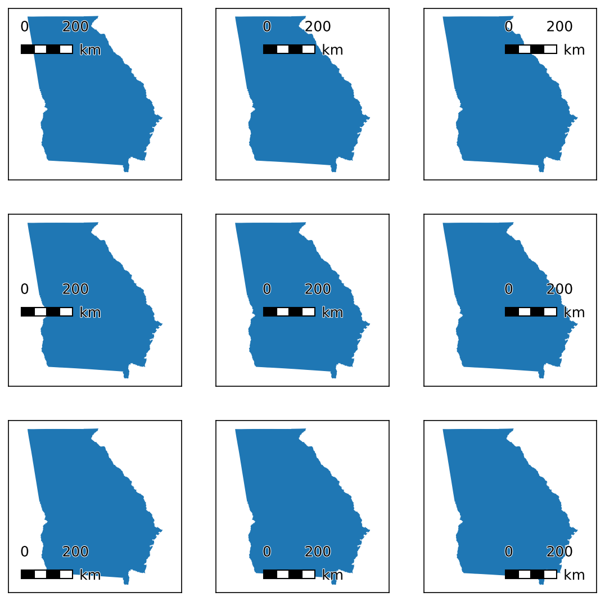

=== "Styles"
	```python
	# Modifying the styles
	styles = ["boxes","ticks"]
	
	# Creating 1x2 subplots
	fig, axs = new_map(1,2, figsize=(10,5))
	
	for ax,s in zip(axs.flatten(), styles):
		states.query(f"NAME=='Georgia'").plot(ax=ax)
		ax.set_aspect(1, adjustable="datalim")
		scale_bar(ax=ax, location="center", style=s, 
				bar={"projection":3857,"minor_type":"none","length":0.5}, labels={"style":"first_last"})
	```

	
		
=== "ZOrder"
	```python
	# An example to show changing zorders
	zorders = [{"plot":5,"scale":10}, {"plot":10,"scale":5}]
	
	# Creating four subplots
	fig, axs = new_map(1,2, figsize=(10,5))
	
	for ax,z in zip(axs.flatten(), zorders):
		states.query(f"NAME=='Georgia'").plot(ax=ax, zorder=z["plot"])
		ax.set_aspect(1, adjustable="datalim")
		scale_bar(ax=ax, location="upper left", 
				bar={"projection":3857,"minor_type":"none","length":0.5}, labels={"style":"first_last"}, zorder=z["scale"])
	```

	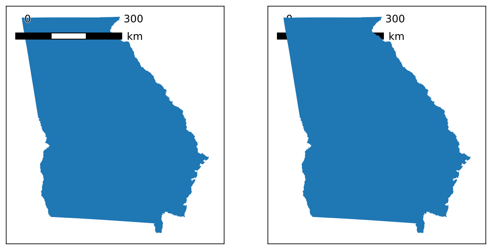

### Visible Components
There are three "visible" components to the scale bar. Each of these is separately customisable, but **unlike** the NorthArrow object, they **cannot** can be turned off entirely by passing a value of `False` to the function or during object, as each component is necessary for a `ScaleBar` (passing `None` still uses default values).

#### Bar
`bar` is the most important component, and has the most customisation options. 

| Attribute | Description | Accepts |
| :--- | :--- | :--- |
| `projection` | The coordinate reference system (CRS) that the map is in (I am considering making it a top-level variable like `style` and `location`). <details class="warning"> <summary> Projected vs Unprojected </summary	> <p> Projected reference systems are preferred; unprojected ones will be approximated to metres based on the great circle distance. </p> </details> |  Any `pyproj` CRS value, including strings and integers, as well as the special options available per [this subsection](#specifying-length) |
| `unit` | The unit of measurement that you want the scale bar to be in. <ul> <li>If left blank, will be the same as the unit of measurement of the `projection`. </li> <li>Otherwise, will handle conversion between the two: useful if you are using a projection in metres and want to convert it to kilometers or feet. </li> </ul> <details class="warning"> <summary> Auto-Scaling </summary> <p> if left *blank*, or set to `None`, this will auto-scale meters and feet to kilometers and miles, respectively, when the *axis* is >5 kilometers or miles wide/tall. To disable this behavior, simply specify a value for this argument (i.e. `unit="ft"`). </p> </details> | See `validation.scale_bar.units_standard` for acceptable values, but the following shorthand will work: <ul> <li>`m` for meters,</li> <li>`ft` for feet,</li> <li>`km` for kilometers,</li> <li>`yd` for yards,</li> <li>`mi` for miles,</li> <li>`nmi` for nautical miles</li> |
| `rotation` | For rotating the scale bar an arbitrary number of degrees; useful for creating a vertically-oriented scale bar. |  A number between -360 and 360 |
| `max` | The max value of the scale bar, in the same units as `unit` (or `projection` if `unit` is None). If left blank, will be approximated based on the value of `length`. | Any positive number |
| `length` | The desired length of the bar <ul><li>in **inches** (for values greater than 1), or</li> <li>as a **fraction of the axis width** (for values between 0 and 1)</li> If left blank, will be approximated as ~25% of the axis. <details class="warning"> <summary> Auto-Rounding </summary> <p> Note that any values set here will also be rounded for convenience: so if you want a 3 inch scale bar, but that equals 91,000 kilometers, you should expect that to be rounded down to 90,000 kilometers, and your scale bar to therefore be a little less than 3 inches. </p> | Any positive number |
| `height` | The desired height of the bar (cross-axis from the bar `length` regardless of orientation set by `rotation`) in **inches**. <br><br> Note that for `ticks`, this will set the height of the `major` ticks (instead of the `minor` ones). | Any positive number |
| `reverse` | Whether or not to flip the order of the bar's segments; for a "typical" scale bar, that would mean the max is on the left instead of the right. | Either `True` or `False` |
| `major_div` | The number of "major" divisions in the bar (see minor divisions below for the difference). Note that this can only be set alongside `max`: setting it on its own will not do anything. <br><br> If left blank, will be approximated based on the `length` and `max` values. | Any integer |
| `major_mult` | The length of a "major" division in the bar - only used when specifying the length of the bar as a multiple of major divisions and division size (see [this section](#specifying-length) for details). Note that this can only be used in conjunction with `major_div`: setting it on its own will not do anything. | Any integer |
| `minor_div` | The number of "minor" divisions *in each major division*; a bar with 2 major division and 2 minor divisions will have 4 divisions in total. |  Any integer, but must be greater than 1 for a minor division to be visible |
| `minor_type` | Controls where minor divisions will appear: <ul><li>If set to `none`, will not have any minor divisions, regardless of what `minor_div` is set to.</li> <li>If set to `first`, then only the first *major* division will be subdivided; the rest will be intact.</li> <li>If set to `all`, *all* major divisions will be subdivided.</li> | Any of `none`, `first`, or `all` |


```python
# Modifying specific elements
modifications = [
	{}, # default settings for comparison
	{"unit":"yd"}, # converting units
	{"rotation":90}, # making the bar vertical
	{"height":0.5}, # increasing the height
	{"reverse":True}, # reversing the order of the bar
	{"minor_type":"all"}, # adding minor divisions
	{"length":0.2}, # shortening the bar
	{"length":None,"max":400,"major_div":4,"minor_div":2,"minor_type":"first"}, # setting all the bar divisions
]

# Creating 2x4 subplots
fig, axs = new_map(2,4, figsize=(20,10))

for ax,m in zip(axs.flatten(), modifications):
	states.query(f"NAME=='Georgia'").plot(ax=ax)
	ax.set_aspect(1, adjustable="datalim")
	scale_bar(ax=ax, location="center", style="boxes", labels={"style":"first_last"},
			bar={"projection":3857,"minor_type":"none","length":0.5} | m) # this line just concatenates the two dictionaries together
```

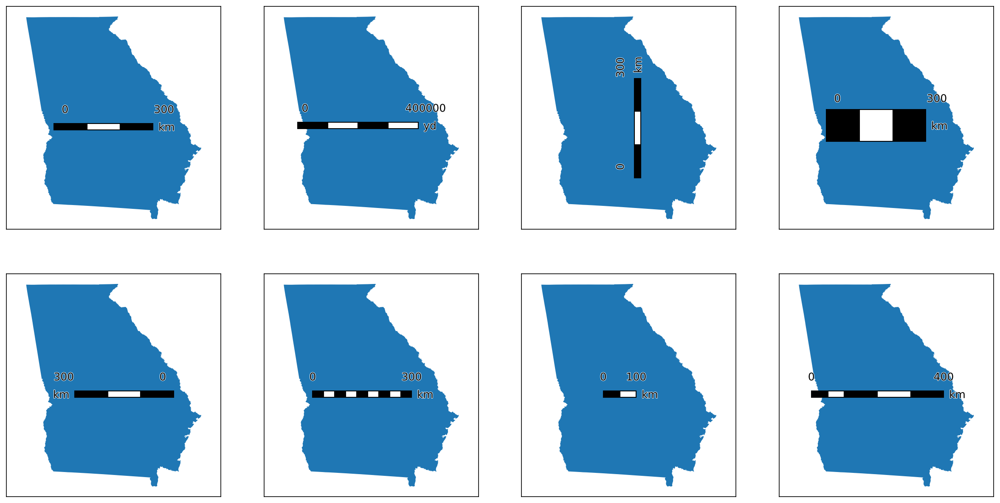

Some additional options are also available based on the the selected `style` of bar:

=== "Boxes"

	| Attribute | Description | Accepts |
	| :--- | :--- | :--- |
	| `facecolors` | The color(s) of the division on the bar. <ul><li>If a single value is passed, it will be used for all divisions.</li> <li>If a list is passed, it will be extended via cycling to the appropriate length (based on the number of division in the bar) if shorter, or it will be truncated, if longer.</li> | Any `matplotlib` color | 
	| `edgecolors` | The color(s) of the edges of the divisions on the bar. <ul><li>If a single value is passed, it will be used for all divisions.</li> <li>If a list is passed, it will be extended via cycling to the appropriate length (based on the number of division in the bar) if shorter, or it will be truncated, if longer.</li> | Any `matplotlib` color |
	| `edgewidth` | The width of the edge of the divisions. Only a singular value may be passed. | Any positive number |

	```python
	# Modifying specific elements
	modifications = [
		{}, # default settings for comparison
		{"facecolors":["red","blue"]}, # changing the colors of the divisions
		{"edgecolors":["red","yellow"]}, # changing the colors of the edges
		# NOTE: I do think this changes the length of the bar which I don't love, so large values not recommended (relative to plot size)
		{"edgewidth":5}, # changing the width of the edges 
	]
	
	# Creating 1x4 subplots
	fig, axs = new_map(1,4, figsize=(20,5))
	
	for ax,m in zip(axs.flatten(), modifications):
		states.query(f"NAME=='Georgia'").plot(ax=ax)
		ax.set_aspect(1, adjustable="datalim")
		scale_bar(ax=ax, location="center", style="boxes", labels={"style":"first_last"},
				bar={"projection":3857,"minor_type":"none","length":0.5} | m) # this line just concatenates the two dictionaries together
	```

	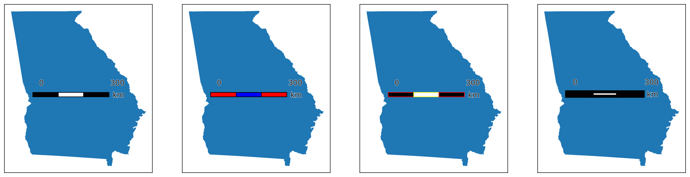

=== "Ticks"

	| Attribute | Description | Accepts |
	| :--- | :--- | :--- |
	| `minor_frac` | the height of the `minor` ticks, as a *fraction of the height of the major ticks* (set by `height`); a value of `0.5` will create minor ticks half the height of the major ticks. | Any positive number |
	| `tick_loc` | the position of the ticks relative to the base bar. | Any of `above`, `below`, or `middle` (if ticks should intersect the bar midway) |
	| `basecolors` | The color(s) of the segments that comprise the "base" of the scale bar. <ul><li>If a single value is passed, it will be used for all divisions.</li> <li>If a list is passed, it will be extended via cycling to the appropriate length (based on the number of division in the bar) if shorter, or it will be truncated, if longer.</li> | Any `matplotlib` color | 
	| `tickcolors` | The color(s) of the ticks marking the scale bar. <ul><li>If a single value is passed, it will be used for all divisions.</li> <li>If a list is passed, it will be extended via cycling to the appropriate length (based on the number of division in the bar) if shorter, or it will be truncated, if longer.</li> | Any `matplotlib` color |
	| `tickwidth` | The width of the base bar and ticks. Only a singular value may be passed. | Any positive number |

	```python
	# Modifying specific elements
	modifications = [
		{}, # default settings for comparison
		# Iterating through the three tick locations
		{"tick_loc":"above"},
		{"tick_loc":"below"},
		{"tick_loc":"middle"},
		# Iterating through the other settings
		{"minor_frac":0.25}, # the default value is 0.66
		{"basecolors":["red","blue"]}, # changing the colors of the divisions
		{"tickcolors":["red","yellow"]}, # changing the colors of the edges
		{"tickwidth":5}, # changing the width of the edges 
	]
	
	# Creating 2x4 subplots
	fig, axs = new_map(2,4, figsize=(20,10))
	
	for ax,m in zip(axs.flatten(), modifications):
		states.query(f"NAME=='Georgia'").plot(ax=ax)
		ax.set_aspect(1, adjustable="datalim")
		scale_bar(ax=ax, location="center", style="ticks", labels={"style":"first_last"},
				bar={"projection":3857,"minor_type":"all","length":0.5} | m) # this line just concatenates the two dictionaries together
	```

	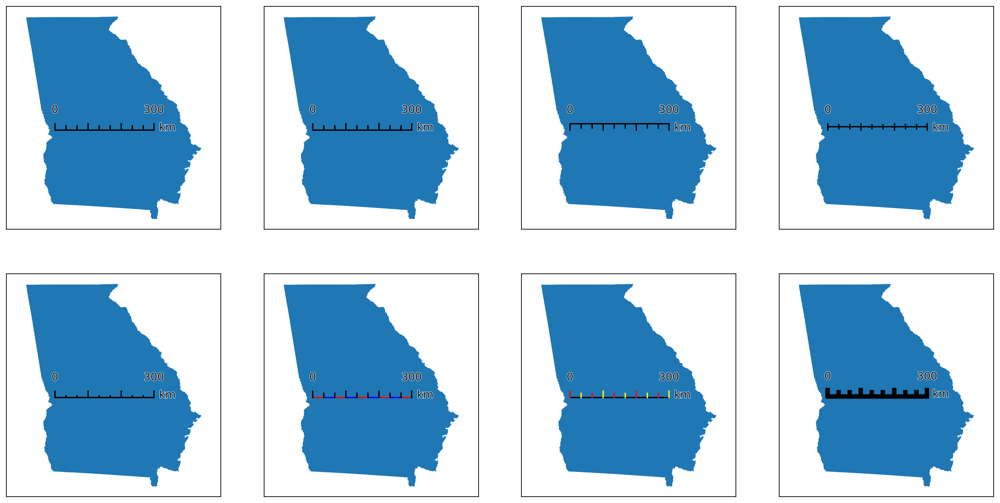

#### Labels
`labels` modifies the text that appears on the divisions of the scale bar (i.e. _not_ including the units text).

| Attribute | Description | Accepts |
| :--- | :--- | :--- |
| `labels` | An override for the label text. Works in tandem with `style` - the number of labels provided should match the number expected based on the `style`. A value of `None` or `True` will auto-generate labels based on the `format` and `format_int` arguments. A `False` value will hide auto-generated labels. | An array of strings, `True`/`False`, or `None` |
| `format` | A format string that can be passed to format the auto-generated labels, if `labels` is `None`. Note: do *not* pass the leading semicolon (i.e. if you want to format with three decimal points, just pass `.3f`). | Valid format string; default is `.0f` |
| `format_int` | If `True` (default), will format "round" floats as integers, by removing their trailing decimals. If `False`, will apply the `format` string to them. | `True` or `False` |
| `style` | Controls *which* labels are placed, based on major/minor divisions. <ul><li>If `major`, labels will be placed on each major division, regardless of if minor divisions exist (# labels = `major_div` + 1).</li> <li>If `first_last`, labels will be placed on the first (0) and last major division (# labels = 2).</li> <li>If `last_only`, labels will be placed exclusively on the last major division (# labels = 1).</li> <li>If `minor_all`, labels will be placed on each major *and* minor division, for each minor division that exists (# labels = `major_div * minor_div + 1`).</li> <li>If `minor_first`, labels will be placed on each major division, and the first (and *only* the first) minor division (# labels = `major_div + 2`).</li> | Any of `major`, `first_last`, `last_only`, `minor_all`, or `minor_first` |
| `loc` | Controls *where* labels are placed. If `above`, labels will be placed above the bar; if `below`, labels will be placed below. | Any of `above` or `below` |
| `fontsize` | The size of the text - see `matplotlib` documentation for more details.. | Any float, int, or string value (such as `small` or `xx-large`) |
| `textcolors` | The color of the main text. | Any `matplotlib` color, as either a single value or a list to be cycled across all the text values |
| `fontfamily` | The appearance of the text - see `matplotlib` documentation for more details. | Any of `serif`, `sans-serif`, `cursive`, `fantasy`, or `monospace` |
| `fontstyle` | The appearance of the text - see `matplotlib` documentation for more details. | Any of `normal`, `italic`, or `oblique` |
| `fontweight` | The appearance of the text - see `matplotlib` documentation for more details. | Any of `normal`, `bold`, `heavy`, `light`, `ultrabold`, or `ultralight` |
| `stroke_width` | The width of the outline of the text. | Any positive number |
| `stroke_color` | The color of the outline of the text. | Any `matplotlib` color |
| `rotation` | The rotation of the text in-place, expressed in degrees. Works in tandem with `rotation_mode` (below). | Any number between -360 and 360 |
| `rotation_mode` | Changes how the rotation of the text occurs. Recommend looking at `matplotlib`'s documentation for details. |Either `anchor` or `default` |
| `sep` | The amount of padding between the labels and the bar, in points. | Any positive number |
| `pad` | The amount of padding around the combined bar and label text, in points. *Note that this is usually kept at 0, as the change is a little nuanced.* | Any positive number |

=== "Styles"

	```python
	# Creating 2x5 subplots
	fig, axs = new_map(2,5, figsize=(25,10))
	
	# Now we define the different label settings
	modifications = [
		# Iterating through the label styles
		{"style":"major"},
		{"style":"first_last"},
		{"style":"last_only"},
		{"style":"minor_all"},
		{"style":"minor_first"},
	]
	
	# We'll first iterate through each of the two minor_types
	for axc,t in zip(axs, ["all","first"]):
		for ax,m in zip(axc, modifications):
			states.query(f"NAME=='Georgia'").plot(ax=ax, color="white")
			ax.set_aspect(1, adjustable="datalim")
			scale_bar(ax=ax, location="center", style="ticks", labels={"fontsize":6} | m, 
					bar={"projection":3857,"max":500,"major_div":2,"minor_div":5,"minor_type":t})
			ax.set_title(m["style"])
	```

	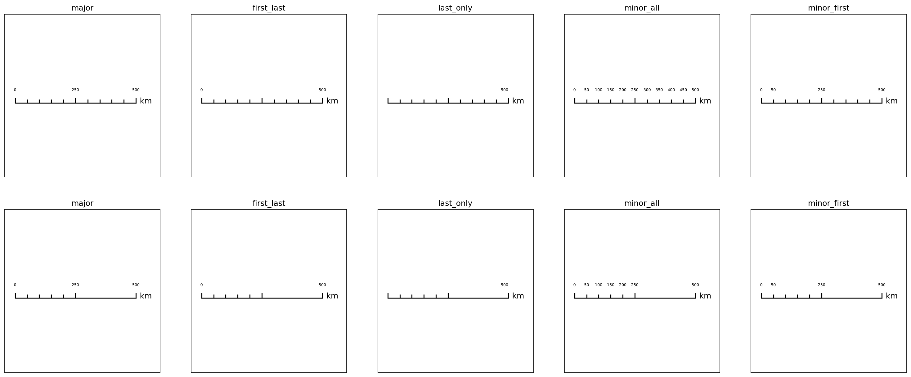

=== "Text"

	```python
	# Modifying other elements
	modifications = [
		{"loc":"above"},
		{"loc":"below"},
		{"textcolors":["yellow","red"]},
		{"rotation":45}, # changing the colors of the divisions
	]
	
	# Creating 1x4 subplots
	fig, axs = new_map(1,4, figsize=(20,5))
	
	for ax,m in zip(axs.flatten(), modifications):
		states.query(f"NAME=='Georgia'").plot(ax=ax)
		ax.set_aspect(1, adjustable="datalim")
		scale_bar(ax=ax, location="center", style="ticks", labels={"style":"major"} | m, # changed the style to major here
				bar={"projection":3857,"max":500,"major_div":5,"minor_div":1,"minor_type":t}) 
	```

	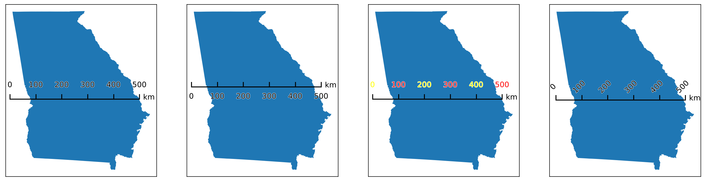

#### Units

`units` modifies the units *label* for the scale bar - <span class="emphasis-ac">it does not change the units of the scale bar itself</span>, as that is instead controlled by `bar["unit"]`. By default, it uses the shorthand of the units of the scale bar (`m` for meters, `ft` for feet, etc.), but this can be manually overridden.

| Attribute | Description | Accepts |
| :--- | :--- | :--- |
| `label` | An override for the default label text. | Any string |
| `loc` | Controls *where* the label is placed. <ul><li>If `bar`, the units labels will be placed in line with the bar (this is the default)</li> <li>If `text`, the label will be appended to the last label</li> <li>If `opposite`, will appear on the opposite side of the bar from the last label.</li> | Any of `bar`, `text`, or `opposite` |

If `loc` is *not* equal to `text`, you can then specify different formatting settings for the label itself:

| Attribute | Description | Accepts |
| :--- | :--- | :--- |
| `fontsize` | The size of the text - see `matplotlib` documentation for more details.. | Any float, int, or string value (such as `small` or `xx-large`) |
| `textcolor` | The color of the main text. | Any `matplotlib` color |
| `fontfamily` | The appearance of the text - see `matplotlib` documentation for more details. | Any of `serif`, `sans-serif`, `cursive`, `fantasy`, or `monospace` |
| `fontstyle` | The appearance of the text - see `matplotlib` documentation for more details. | Any of `normal`, `italic`, or `oblique` |
| `fontweight` | The appearance of the text - see `matplotlib` documentation for more details. | Any of `normal`, `bold`, `heavy`, `light`, `ultrabold`, or `ultralight` |
| `stroke_width` | The width of the outline of the text. | Any positive number |
| `stroke_color` | The color of the outline of the text. | Any `matplotlib` color |
| `rotation` | The rotation of the text in-place, expressed in degrees. Works in tandem with `rotation_mode` (below). | Any number between -360 and 360 |
| `rotation_mode` | Changes how the rotation of the text occurs. Recommend looking at `matplotlib`'s documentation for details. |Either `anchor` or `default` |

If `loc` is set to `opposite`, you can control its positioning independently:

| Attribute | Description | Accepts |
| :--- | :--- | :--- |
| `sep` | The amount of padding between the units label and the bar, in points. | Any positive number |
| `pad` | The amount of padding around the combined bar and units label text, in points. *Note that this is usually kept at 0, as the change is a little nuanced.* | Any positive number |

=== "Locations"

	```python
	# This block will show the different label locations
	# Creating 1x3 subplots
	fig, axs = new_map(1,3, figsize=(15,5))
	
	# Now we define the different label settings
	modifications = [
		# Iterating through the label locations
		{"loc":"bar"},
		{"loc":"text"},
		{"loc":"opposite"}, # this one looks best when bar["minor_type"] = "last_only"
	]
	
	# We'll first iterate through each of the two minor_types
	for ax,m in zip(axs.flatten(), modifications):
		states.query(f"NAME=='Georgia'").plot(ax=ax, color="white")
		ax.set_aspect(1, adjustable="datalim")
		scale_bar(ax=ax, location="center", style="ticks", labels={"style":"first_last"}, units=m,
					bar={"projection":3857,"max":300,"major_div":3,"minor_div":1,"minor_type":"none"})
		ax.set_title(m["loc"])
	```
			
	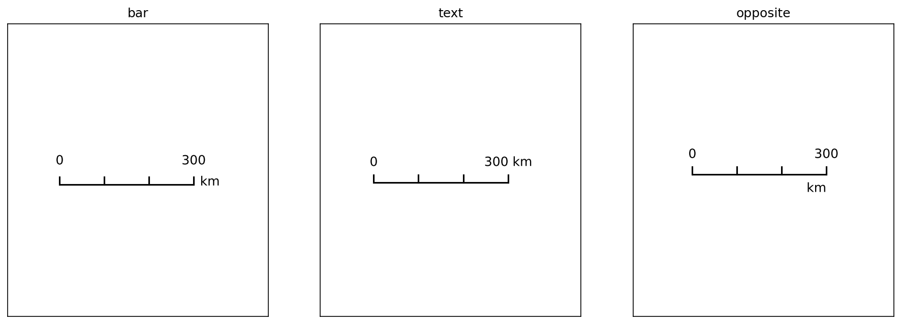

=== "Text"

	```python
	# Modifying other elements
	modifications = [
		{}, # default for comparison
		{"label":"kilometer"},
		{"textcolor":"red"}, # changing the color of the units label, without affecting the other lables
		{"rotation":-45},
	]
	
	# Creating 1x4 subplots
	fig, axs = new_map(1,4, figsize=(20,5))
	
	for ax,m in zip(axs.flatten(), modifications):
		states.query(f"NAME=='Georgia'").plot(ax=ax)
		ax.set_aspect(1, adjustable="datalim")
		scale_bar(ax=ax, location="center", style="ticks", labels={"style":"major"}, units=m, # changed the style to major here
			bar={"projection":3857,"max":300,"major_div":3,"minor_div":1,"minor_type":"none"}) 
	```

	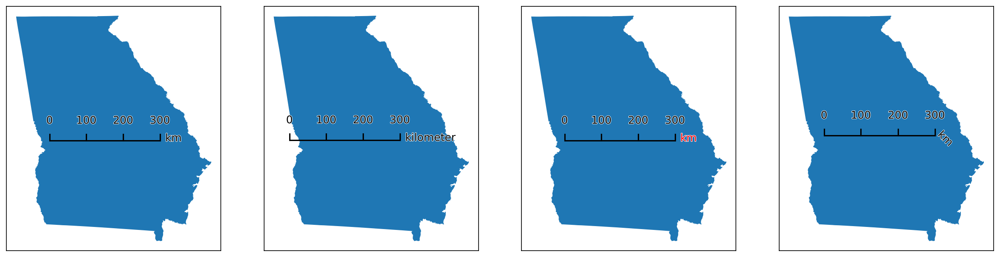

### Formatting Components
There are two "invisible" components to the scale bar - so called because they are mainly there to help alter the position or formatting of the components, but are not directly tied to an individual component.

#### Text
`text` is a shorthand way of changing shared settings for the `label` and `units` *together*. This is useful, for example, if you want to change the fontsize, color, or family for both components, without having to set each setting twice.

| Attribute | Description | Accepts |
| :--- | :--- | :--- |
| `fontsize` | The size of the text - see `matplotlib` documentation for more details.. | Any float, int, or string value (such as `small` or `xx-large`) |
| `textcolor` | The color of the main text. *Unlike the relevant setting in `label`, will only accept a single value to be used for all the text colors at once*. | Any `matplotlib` color |
| `fontfamily` | The appearance of the text - see `matplotlib` documentation for more details. | Any of `serif`, `sans-serif`, `cursive`, `fantasy`, or `monospace` |
| `fontstyle` | The appearance of the text - see `matplotlib` documentation for more details. | Any of `normal`, `italic`, or `oblique` |
| `fontweight` | The appearance of the text - see `matplotlib` documentation for more details. | Any of `normal`, `bold`, `heavy`, `light`, `ultrabold`, or `ultralight` |
| `stroke_width` | The width of the outline of the text. | Any positive number |
| `stroke_color` | The color of the outline of the text. | Any `matplotlib` color |
| `rotation` | The rotation of the text in-place, expressed in degrees. Works in tandem with `rotation_mode` (below). | Any number between -360 and 360 |
| `rotation_mode` | Changes how the rotation of the text occurs. Recommend looking at `matplotlib`'s documentation for details. |Either `anchor` or `default` |

```python
# Modifying specific elements
modifications = [
	{}, # default settings
	{"fontsize": 16}, # increased size
	{"fontweight": "bold"}, # different weight
	{"stroke_color": "black", "stroke_width":3, "textcolor": "white"}, # changing the mode, not a great example
]

# Creating four subplots
fig, axs = new_map(1,4, figsize=(20,5))

for ax,m in zip(axs.flatten(), modifications):
	states.query(f"NAME=='Georgia'").plot(ax=ax)
	ax.set_aspect(1, adjustable="datalim")
	scale_bar(ax=ax, location="center", style="ticks", labels={"style":"major"}, text=m,
			bar={"projection":3857,"max":300,"major_div":3,"minor_div":1,"minor_type":"none"}) 
```
	
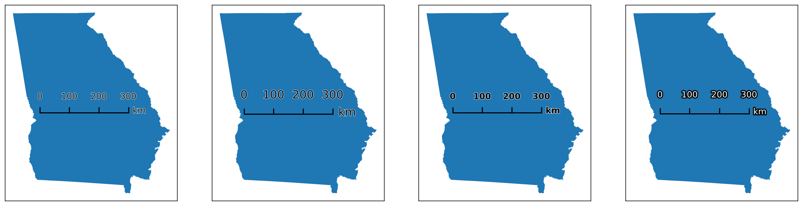

#### AOB
`aob` customizes the [`AnchoredOffsetBox`](https://matplotlib.org/stable/api/offsetbox_api.html#matplotlib.offsetbox.AnchoredOffsetbox) object that handles the positioning of the final scale bar object with respect to the *plot*. Note that `facecolor`, `edgecolor`, and `alpha` are non-standard options.

| Attribute | Description | Accepts |
| :--- | :--- | :--- |
| `facecolor` | The color of the `AnchoredOffsetBox` patch. | Any `matplotlib` color |
| `edgecolor` | The color of the edge of the `AnchoredOffsetBox` patch. | Any `matplotlib` color |
| `alpha` | The transparency of the `AnchoredOffsetBox` patch. | Any `matplotlib` color |
| `pad` | The amount of padding around the north arrow, defining the edges of the `AnchoredOffsetBox`. Expressed as *a fraction of the fontsize specified in `prop`*. | Any positive number |
| `borderpad` | The amount of padding between the `AnchoredOffsetBox` and the `bbox_to_anchor`, if one is specified. Expressed as *a fraction of the fontsize specified in `prop`*. | Any positive number |
| `prop` | A reference fontsize used to define the paddings of `pad` and `borderpad`. | Any valid fontsize input |
| `frameon` | Whether or not to draw a frame around the box. | Either `True` or `False` |
| `bbox_to_anchor` and `bbox_transform` | Used to customize the placement of the `AnchoredOffsetBox`. | See *Tips and Tricks* section for details |

```python
# Modifying specific elements

modifications = [
	{"facecolor": "lightgrey"}, # different facecolor
	{"edgecolor": "red"}, # different edgecolor; note that this automatically sets the facecolor to white
	# these two show the difference between pad and borderpad
	{"edgecolor": "red", "pad": 3}, # increased pad
	{"edgecolor": "red", "borderpad": 3}, # increased borderpad, which is "invisible" relative to where the edge is
]

# Creating four subplots
fig, axs = new_map(1,4, figsize=(20,5))

for ax,m in zip(axs.flatten(), modifications):
	states.query(f"NAME=='Georgia'").plot(ax=ax)
	ax.set_aspect(1, adjustable="datalim")
	scale_bar(ax=ax, location="upper right", style="ticks", labels={"style":"major"}, aob=m, # using location="upper right" to illustrate borderpad
			bar={"projection":3857,"max":300,"major_div":3,"minor_div":1,"minor_type":"none"}) 
```

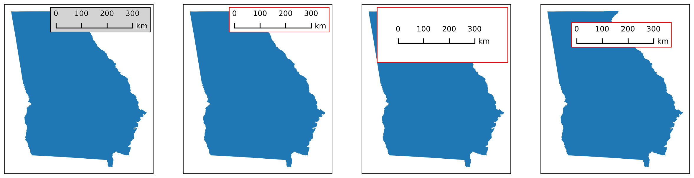

---

## Tips and Tricks

### Recreating `matplotlib-scalebar`
The initial inspiration for creating this package was [`matplotlib-scalebar`](https://github.com/ppinard/matplotlib-scalebar/tree/master), which has not been updated in a while, and was generally found to be insufficient for geographic needs in particular. However, for those who want to recreate the look of the scalebars created by the package, there is a trick for doing so: if `label["style"]=="last_only"` *and* `major_div==1` *and* `minor_div==1`, then the label will be drawn *centered* underneath the 1-div bar.

```python
fig, ax = new_map(1,1, figsize=(5,5))

# Plotting the a state
states.query(f"NAME=='Georgia'").plot(ax=ax)

# Setting up the scale bar
scale_bar(ax=ax, location="upper right", style="boxes",
		bar={"projection":3857,"max":100,"major_div":1,"minor_div":1,"minor_type":"none"},
		labels={"style":"last_only","loc":"below","fontsize":8}, units={"loc":"text"},
		aob={"facecolor":"whitesmoke","edgecolor":"none","pad":0.5,"borderpad":0.5})
```

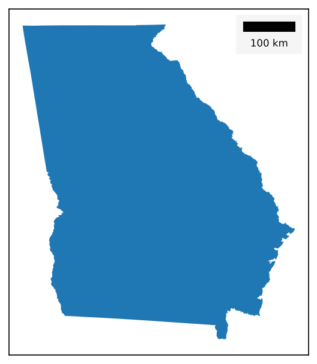

### Setting Size
While the scale bar can nominally have its size changed by changing the `length` attribute, doing so doesn't change the other, related components, such as the sizes of the text, the the box dimensions, the stroke widths, and so on.

However, given that there are standardized paper sizes that most graphics are made towards, a `size` parameter is available that will select pre-configured default values that approximate what looks best at each size. The parameter takes in only one input, which is the size tier you want:

* `xsmall` or `xs` for A8 paper, ~2 to 3 inches

* `small` or `sm` for A6 paper, ~4 to 6 inches

* `medium` or `md` for A4 or letter paper, ~8 to 11 inches

* `large` or `lg` for A2 paper, ~16 to 24 inches

* `xlarge` or `xl` for A0 paper, ~33 to 48 inches

These default values can be seen in `defaults/scale_bar.py`.

```python
# For reference, this is 5 inches x 10 inches
fig, ax = new_map(1,1, figsize=(5,10))

# Plotting the a state
states.query(f"NAME=='California'").plot(ax=ax)

# Visualizing three different sizes at various positions
for s,l in zip(["sm","md","lg"], ["upper center", "center", "lower center"]):
	scale_bar(ax=ax, size=s, location=l, style="boxes", labels={"style":"major"}, 
			bar={"projection":3857,"max":900,"major_div":3,"minor_div":1,"minor_type":"none"})

# No need to reset sizes - the size= parameter handles it per-call
```

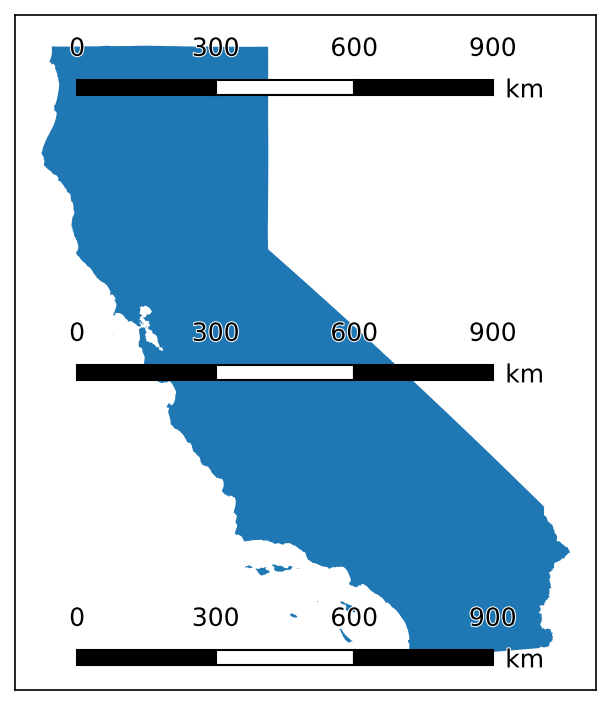

### Placing Scale Bars Outside of Axis
Sometimes it is more desireable to place the scale bar outside of the plot entirely, which can be accomplished using `bbox_to_anchor` and `bbox_transform` from the `aob`component settings. This works the same way it does for [`matplotlib.pyplot.legend`](https://matplotlib.org/stable/api/_as_gen/matplotlib.pyplot.legend.html#matplotlib.pyplot.legend).

```python
fig, ax = new_map()

states.query("NAME=='Georgia'").plot(ax=ax)

scale_bar(ax=ax, location="upper center", style="boxes", labels={"style":"major"}, 
			bar={"projection":3857,"max":500,"major_div":5,"minor_div":1,"minor_type":"none"}, 
			aob={"bbox_to_anchor":(0.5,-0.01), "bbox_transform":ax.transAxes})
```
		
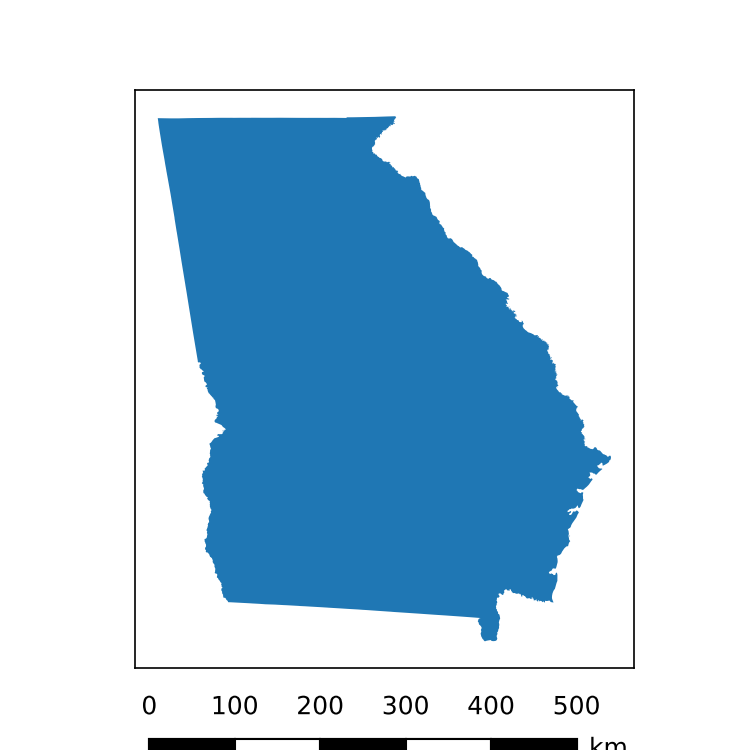

### Dual Scale Bars
One common form for scale bars is to present two of them side-by-side, with different units of measurement (such as kilometres and miles). This can be accomplished in two ways:

=== "dual_bars()"

	Using the function `dual_bars()` will recreate the steps outlined in __Manually__ automatically, though with more limited customization between the two bars: you can only change the `units`, `bar_max`, `bar_length`, `major_div`, and `minor_div` of the bars; all *formatting* elements must be the same.

	!!! warning
		This function is experimental, and is particularly prone to breaking when `rotation` is set to a value other than `0` - if people give feedback that it is useful, I will spend time cleaning it up!

	```python
	# Using dual_bars()
	from matplotlib_map_utils import dual_bars

	fig, ax = new_map(1,1, figsize=(5,5))
	_ = states.query("NAME=='Georgia'").to_crs(3520).plot(ax=ax)

	# Note that this handles the flipping of the ticks and labels automatically!
	dual_bars(ax=ax, draw=True, style="ticks", location="center", 
			# For these settings, the first item in the list will apply to the top bar, and the second to the bottom
			units_dual=["km","mi"], bar_maxes=[300,200], major_divs=[3,4], minor_divs=[1,1], # you could set bar_length=[x,y] here too
			# These settings are shared among all the bars
			bar={"projection":3520,"rotation":0,"reverse":False,"minor_type":"none"},
			labels={"style":"major"},
			units={"loc":"text"}, 
			text={"stroke_width":1,"stroke_color":"white","fontsize":"xx-small"},
			# These settings are for the V/HPacker (see the manual example)
			sep=1.5, pad=0)
	```

	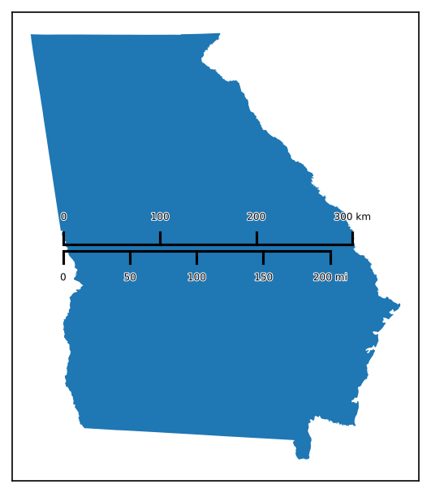

=== "Manually"

	Create two bars using the `scale_bar()` function with `draw=False` and `return_aob=False`. Each function will return an [`OffsetImage`](https://matplotlib.org/stable/api/offsetbox_api.html#matplotlib.offsetbox.OffsetImage) object, which can be placed in a `VPacker` or `HPacker`, and the placed in a `AnchoredOffsetBox` to assist with positioning. Note that any settings passed to `aob` will be ignored!

	```python
	# Manual version
	import matplotlib.offsetbox

	fig, ax = new_map(1,1, figsize=(5,5))
	_ = states.query("NAME=='Georgia'").to_crs(3520).plot(ax=ax)

	# First the bar showing kilomtres
	km = scale_bar(ax=ax, draw=False, return_aob=False, style="ticks", location="center",
					bar={"projection":3520,"unit":"km","max":300,"major_div":3,"minor_div":1,
								"rotation":0,"reverse":False,"minor_type":"none"},
					labels={"style":"major"},
					units={"loc":"text"}, 
					text={"stroke_width":1,"stroke_color":"white","fontsize":"xx-small"})

	# Then the bar showing miles
	# Note that I have to MANUALLY change the location of the ticks and the lables
	mi = scale_bar(ax=ax, draw=False, return_aob=False, style="ticks", location="center",
					bar={"projection":3520,"unit":"mi","max":200,"major_div":4,"minor_div":1,
								"rotation":0,"reverse":False,"minor_type":"none","tick_loc":"below"},
					labels={"style":"major","loc":"below"},
					units={"loc":"text"}, 
					text={"stroke_width":1,"stroke_color":"white","fontsize":"xx-small"})

	# Now, placing each OffsetImage inside of a VPacker
	pack = matplotlib.offsetbox.VPacker(children=[km,mi], align="left", pad=0, sep=1.5)
	# And placing that into an AnchoredOffsetBox
	aob = matplotlib.offsetbox.AnchoredOffsetbox(loc="center", child=pack, frameon=False)
	# And drawing it onto the axis
	_ = ax.add_artist(aob)
	```

	

### Accessing Artists

Unlike the North Arrow, the the `rotation` option is meant to affect *all* of the subcomponents: boxes/ticks and labels. As far as I can tell, this is not possible with an `AnchoredOffsetBox` (which contains all the subcomponents) placed inside of an `AuxTransformBox` (which can apply a rotation transformation) - I tried *many* times to debug this, if you know how to make it work then let me know.

Instead, I render the final box, pre-rotation, as an Image using `matplotlib`'s `buffer_rgba()` on a temporary figure I constructed. This flattens everything, returning just the array of Image values that I then use to create an `OffsetImage()`, which is what is ultimately returned. See the function `render_as_image()` in `core.scale_bar.py` if you are interested to see how it works.
